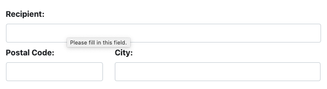
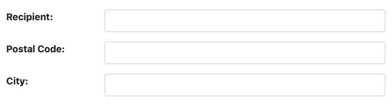
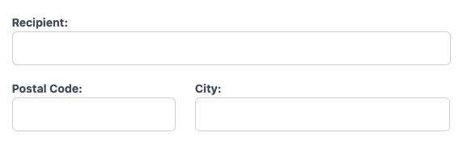
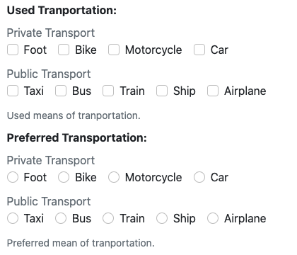
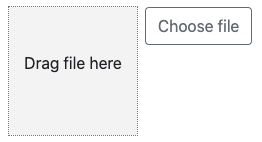
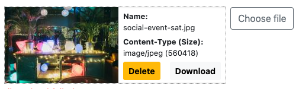
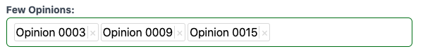
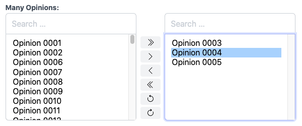

# django-formset – Better UX for Django Forms 

This library handles single forms and collections of forms with a way better user experience than
the internal Django implementation for
[formsets](https://docs.djangoproject.com/en/stable/topics/forms/formsets/) offers.

[](https://github.com/jrief/django-formset/actions)
[](https://pypi.python.org/pypi/django-formset)
[](https://pypi.python.org/pypi/django-formset)
[](https://pypi.python.org/pypi/django-formset)
[](https://github.com/jrief/django-formset/blob/master/LICENSE)

[Interactive documentation](https://django-formset.fly.dev/)

Let's explain it using a short example. Say, we have a Django form with three fields:

```python
from django.forms import fields, forms

class AddressForm(forms.Form):
    recipient = fields.CharField(label="Recipient")
    postal_code = fields.CharField("Postal Code")
    city = fields.CharField(label="City")
```

After creating a
[Django FormView](https://docs.djangoproject.com/en/stable/ref/class-based-views/generic-editing/#django.views.generic.edit.FormView)
we can render the above form using a slightly modified template:

```html


```

This will render our form using the layout and CSS classes as proposed by
[Bootstrap's style guide](https://getbootstrap.com/docs/5.1/forms/overview/):



Or if rendered with alternative CSS classes:

```html


```




Or if rendered with the Tailwind renderer:

```html


```



**django-formset** provides form renderers for all major CSS frameworks, such as
[Bootstrap 5](https://getbootstrap.com/docs/5.1/forms/overview/),
[Bulma](https://bulma.io/documentation/form/general/),
[Foundation 6](https://get.foundation/sites/docs/forms.html),
[Tailwind](https://tailwindcss.com/) and [UIkit](https://getuikit.com/).


### Multiple Input Widgets

Furthermore, it can render all widgets provided by Django (except Geospacials). This includes
[multiple checkboxes](https://docs.djangoproject.com/en/stable/ref/forms/widgets/#checkboxselectmultiple)
and radio selects, even with multiple option groups:




### File Uploading Widget

Uploading files is performed asynchronously, separating the payload upload from its form submission.
It provides a drag-and-drop widget plus a file select button. This allows to preview uploaded files
before form submission. It also make the submission much faster, because the file is already in a
temporary location on the server.

| Empty file upload                         | Pending file upload                 |
|-------------------------------------------|-------------------------------------|
|  |  |


### Alternatives for `<select>` and `<select multiple>` Widgets

The default HTML `<select>` widget can be replaced by a counterpart with autocompletion. No extra
endpoint is required, because that's handled by the Django view already controlling the form.

The default HTML `<select multiple="multiple">` widget can be replaced by two different widgets, one
which keeps the selected options inlined, and one which keeps them inside a "select-from" and a
"selected option" field.

| Multi Select with autocomplete        | Multi Select with source and target       |
|---------------------------------------|-------------------------------------------|
|  |  | 

Similar widgets can be found in the Django admin to make many-to-many relations editable. In
**django-formset**, the right widget (with source and target) offers some additional features:

* It can handle relations where the source contains too many entries to be loaded once. Instead,
  this widget queries the database when searching for an option. It uses the same autocomplete
  endpoint.
* The right part of the widget can be filtered as well.
* The widget has a redo/undo functionality in case the user mistakenly selected wrong option(s).
* Optionally, selected options in the right part of the widget can be sorted. This order then is
  reflected in an
  [extra field](https://docs.djangoproject.com/en/stable/topics/db/models/#intermediary-manytomany)
   on the many-to-many relationship.


## Button actions

In **django-formset**, the button used for submission can hold a chain of actions. This for instance
allows to disable the button, and/or add a spinning wheel while submitting data. It also is possible
to specify the success page as a HTML link, rather than having it to hard-code inside the Django
view. There is a complete set of predefined actions to select from, when designing the submit
button.


## Immediate Form Validation

Each field is validated as soon as it looses focus. This gives immediate feedback and signalizes if
some user input will not be accepted, when submitting the form. The browser side validation
constraints are excatly the same, as those defined for each Django field in Python.

Not every value or combination of thereof can be validated by the browser, but instead may be
rejected by the backend application. For instance, the `clean()`- and/or `clean_FIELDNAME()`-methods
may complain about values using some kind of internal logic.

Those serverside errors are sent back to the client and shown nearby the offending fields without
having to re-render the complete page. On success, a given page is loaded (or another alternative
action is performed).


## Grouping Forms

As the name "formset" suggests, **django-formset** allows to manage more than one form. It therefore
is possible to create collections of forms and even nest those collections into each other.
Collections can be declared to have siblings, allowing them to be instantiated multiple times. This
is similar to Django's Stacked- and Tabular-Inlines, but allows an infinite number of nesting
levels. Moreover, such collections with siblings can optionally be sorted.

[](https://youtu.be/dxyzzGOeNY4)

[watch as video](https://youtu.be/dxyzzGOeNY4)

A form collection is also useful to create an editor for models wich have a one-to-one relation.
The Django admin for instance requires to use a Stacked- or Tabular-Inline, which however is
designed to handle one-to-many relations. With collections these two interconnected models can be
handled with seemingly the same form (although in the background those are separated entinties).


## Conditional hiding/disabling

Since each formset holds its state (the current value of their fields), that information can be used
to conditionally hide or disable other fields or even a complete fieldset.

By adding the special attributes `df-show="condition"`, `df-hide="condition"` or
`df-disable="condition"` on an input fields or on a fieldsets, one can hide or disable these marked
fields. This `condition` can be any expression evaluating the current field values of the formset.


## How does this all work?

**django-formset** makes use of the
[form renderer](https://docs.djangoproject.com/en/stable/ref/forms/renderers/) introduced in
Django 4. This allows to create special renderers for each of the supported CSS frameworks. In
addition to the form structure proposed by those framework vendors, this library adds private HTML
tags to each field containg the constraint information as declared in Python.

The form or the collections of forms then is wrapped by the provided
[webcomponent](https://developer.mozilla.org/en-US/docs/Web/Web_Components) `<django-formset>`.
The JavaScript part (actually TypeScript) making up that webcomponent then handles the form
validation, its submission, instantiation or removal of collection siblings, etc.

Some of the widgets described above (select with autocomplete, file upload) also require JavaScript
code. The client side functionality of those widgets is also is handled by that webcomponent.
Widgets which require autocompletion use the same endpoint as that webcomponent itself. So there is
no need to add extra endpoints to the URL router.

This finally means, that an enduser must _only_ import this single JavaScript file and wrap its
single form or collection of forms into a single HTML element such as

```html
<django-formset endpoint="/path/to/myproject/view" csrf-token="…">
  …
</django-formset>
```

The Django view handling the form or collection of forms requires a special mixin class but
otherwise is the same as those proposed by Django, for instance its
[FormView](https://docs.djangoproject.com/en/stable/topics/class-based-views/generic-editing/).

The form classes can be reused unaltered, except for replacing the widgets if desired or required
(the `FileField` requires a different widget).


## Reference Documentation

Reference documentation can be found on
[Read The Docs](https://django-formset.readthedocs.io/en/latest/index.html).


## Demo

A [demo](https://django-formset.fly.dev/) showing all combinations of fields.


## Motivation

Instead of using a `<form>`-tag and include all its fields, here we wrap the complete form inside
the special webcomponent `<django-formset>`. It allows the client to communicate with the Django
view (we name this "endpoint") using the
[fetch API](https://developer.mozilla.org/en-US/docs/Web/API/Fetch_API/Using_Fetch).
This means, that multiple `<form>`-elements can be wrapped into a formset. It also means, that the
submit `<button>` can be placed outside of the `<form>`-element. By doing so, the form's payload
is sent using `Content-Type: application/json` instead of the usual
`Content-Type: application/x-www-form-urlencoded`. By using JSON for the payload, the form data is
mapped into JavaScript objects and collections of forms are represented by nested data structures.

**When designing this library, the main goal was to keep the programming interface a near as
possible to the way Django handles forms, models and views.**


## Summary

* Before submitting, all form fields are prevalidated by the browser, using the same constraints as
  declared for each Django form or model field in Python.
* The form's data is sent by an Ajax request, preventing a full page reload. This gives a much
  better user experience.
* Server side validation errors are sent back to the browser, and rendered near the offending
  form field.
* Non-field validation errors are renderer together with the form.
* CSRF-tokens are handled through a HTTP-Header, hence there is no need to add a hidden input field
  to each form.
* Forms can be rendered for different CSS frameworks using their specific style-guides for arranging
  HTML. Curently **django-formset** includes renderers for:

  * [Bootstrap 5](https://getbootstrap.com/docs/5.0/forms/overview/),
  * [Bulma](https://bulma.io/documentation/form/general/),
  * [Foundation 6](https://get.foundation/sites/docs/forms.html),
  * [Tailwind](https://tailwindcss.com/) [^1]
  * [UIKit](https://getuikit.com/docs/form)

  It usually takes about 50 lines of code to create a renderer and most widgets can even be rendered
  using the default template as provided by Django. 
* No external JavaScript dependencies are required. The client part is written in pure TypeScript
  and compiles to a single, portable JS-file.
* Support for all standard widgets Django currently offers (except GeoSpacials).
* File uploads are handled asynchronously, separating the payload upload from the form submission.
* Select boxes with too many entries, can be filtered by the server using a search query.
* Radio buttons and multiple checkboxes with only a few fields can be rendered inlined rather than
  beneath each other.
* The submit button(s) can be configured as a chain of actions.
* A formset can group multiple forms into a collection. Collections can be nested. On submission,
  the data from this form or collection of forms is sent to the server as a group a separate
  entities.
* Such a form-collection can be declared to have a list siblings, which can be changed in length
  using one "Add" and multiple "Remove" buttons.
* Form fields or fieldsets can be hidden or disabled using a Boolean expression as condition.

[^1]: Tailwind is special here, since it doesn't include purpose-built form control classes out of
      the box. Instead **django-formset** offers an opinionated set of CSS classes suitable for
      Tailwind.
