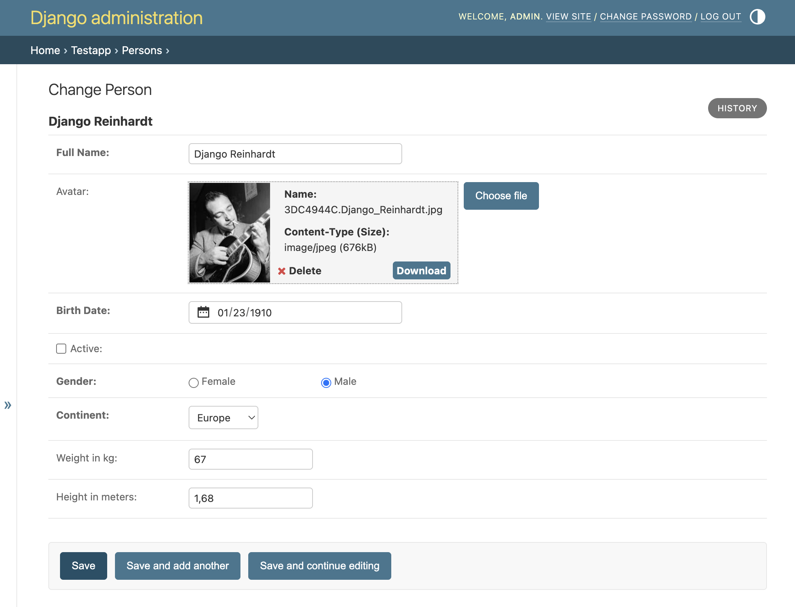
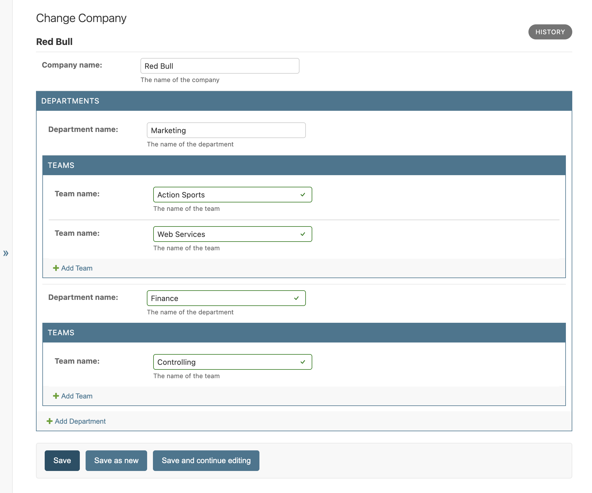

.. _admin-integration:

========================
Django-Admin Integration
========================

.. versionadded:: 2.0

One of the goals of **django-formset** is to offer a flexible and easy to use library for
manipulating formsets and to offer widgets with a way better usability than the builtin HTML form
fields. During the development, the Django-Admin_ was an inspiration for many features of this
library. Developers may recognize the similarities between the StackedInline_- of the Django-Admin
and the :ref:`form-collections` of **django-formset**. The :ref:`dual-selector` is another such
example, which the Django-Admin is referring as `filter horizontal`_. 

.. _Django-Admin: https://docs.djangoproject.com/en/stable/ref/contrib/admin/
.. _StackedInline: https://docs.djangoproject.com/en/stable/ref/contrib/admin/#inlinemodeladmin-objects
.. _filter horizontal: https://docs.djangoproject.com/en/stable/ref/contrib/admin/#django.contrib.admin.ModelAdmin.filter_horizontal

Declaration over Configuration
==============================

The principal view class of the Django-Admin is the `ModelAdmin`_. This class is responsible for
converting a Django model into a form and optionally into extra fieldsets. It also provides a
way to handle one level of related models, which are displayed as inlines. In a minimalistic
configuration, a developer only needs to declare the model. However, this minimalism comes at a
price because developers are bound by the constraints imposed by configuration options of that
class.

.. _ModelAdmin: https://docs.djangoproject.com/en/stable/ref/contrib/admin/

**django-formset** provides an alternative class :class:`formset.admin.ModelAdmin` to be used as a
replacement for Django's ``ModelAdmin``. This class requires just one mandatory attribute, either
``form`` or ``collection_class``. The ``form`` attribute must refer to an instance of a subclass of
:class:`formset.forms.ModelForm`. The ``collection_class`` attribute must refer to an instance of a
subclass of :class:`formset.collection.CollectionForm`. The attributes ``collection_class`` and
``form``  are mutually exclusive and must not be used together on the same instance of a
``ModelAdmin`` class.

The other attributes offered by Django's ``ModelAdmin``, have no effect if used with the
implementation of **django-formset**. Instead of using various configuration directives, a
declarative approach is used. This means, that developers must create the structure of their forms
using the components provided by **django-formset**. The big advantage of this approach is that
such form-, fieldset- or collection declarations can also be used in normal Django views.

Here is a recipe on how to replace these configuration directives:

.. rubric:: `ModelAdmin.fields <https://docs.djangoproject.com/en/stable/ref/contrib/admin/#django.contrib.admin.ModelAdmin.fields>`_

The ``fields`` attribute of the Django-Admin is used to configure the fields to be displayed in the
form. In **django-formset** this information is redundant, because the used form already declares
the wanted fields.

.. rubric:: `ModelAdmin.fieldsets <https://docs.djangoproject.com/en/stable/ref/contrib/admin/#django.contrib.admin.ModelAdmin.fieldsets>`_

In **django-formset**, fieldsets are declared using the :class:`formset.fieldset.Fieldset` class.
This allows developers to nest fieldsets and to reuse the same fieldset in multiple places. If
rendered in the Django-Admin, a ``<fieldset>`` uses the ``<legend>`` tag to display the fieldset
title. More on this can be found in section :ref:`fieldsets`.

.. rubric:: `ModelAdmin.filter_horizontal <https://docs.djangoproject.com/en/stable/ref/contrib/admin/#django.contrib.admin.ModelAdmin.filter_horizontal>`_

Adding a field name to the ``filter_horizontal`` attribute of the Django-Admin, renders a dual
listbox for that field. This is used to create a widget for a many-to-many relationship between two
models. **django-formset** provides a similar feature, with :class:`formset.widgets.DualSelector`
and alternatively with :class:`formset.widgets.SelectizeMultiple`. These widgets have to be
specified in the ``widget`` attribute of the form's field classes. More on this can be found in
section :ref:`dual-selector`.

.. rubric:: `ModelAdmin.filter_vertical <https://docs.djangoproject.com/en/stable/ref/contrib/admin/#django.contrib.admin.ModelAdmin.filter_vertical>`_

**django-formset** does not provide a vertical dual listbox. And sincerely, I never saw any
implementation using it, nor do I see any need for such a widget.

.. rubric:: `ModelAdmin.form <https://docs.djangoproject.com/en/stable/ref/contrib/admin/#django.contrib.admin.ModelAdmin.form>`_

By default, the Django-Admin creates a ``ModelForm`` dynamically for your model. With this directive
developers can specify a custom form class and override this behaviour. In **django-formset**, this
now is mandatory. So every instance of :class:`formset.admin.ModelAdmin` must specify either a
``form`` class or a ``collection_class``.

.. rubric:: `ModelAdmin.formfield_overrides <https://docs.djangoproject.com/en/stable/ref/contrib/admin/#django.contrib.admin.ModelAdmin.formfield_overrides>`_

This attribute is used to override the default form field or widget of a model field.
In **django-formset**, this is done by specifying the widget in the ``widget`` attribute of the
form's field classes or by overriding the field in the class itself.

.. rubric:: `ModelAdmin.inlines <https://docs.djangoproject.com/en/stable/ref/contrib/admin/#django.contrib.admin.ModelAdmin.inlines>`_

The Django-Admin provides a way to edit related models in a formset. This is done by using the
``inlines`` attribute containing a list of subclasses of :class:`django.contrib.admin.TabularInline`
or :class:`django.contrib.admin.StackedInline`. In **django-formset**, this is done by using one or
more :ref:`form-collections`. Since ``FormCollection``-s can be nested deeply, they are rendered
using a surrounding border each, so that for the user it is clear which subform and field belongs to
which collection.

.. rubric:: `ModelAdmin.list_display <https://docs.djangoproject.com/en/stable/ref/contrib/admin/#django.contrib.admin.ModelAdmin.list_display>`_

The ``list_display`` attribute of the Django-Admin is used by the list-view of a model. Its
behaviour remains unchanged in **django-formset**. The same applies to the attributes
list_display_links_, list_editable_, list_filter_, list_max_show_all_, list_per_page_,
list_select_related_, ordering_, paginator_ and preserve_filters_, search_fields_,
search_help_text_, show_full_result_count_, sortable_by_ and view_on_site_.

.. _list_display_links: https://docs.djangoproject.com/en/stable/ref/contrib/admin/#django.contrib.admin.ModelAdmin.list_display_links
.. _list_editable: https://docs.djangoproject.com/en/stable/ref/contrib/admin/#django.contrib.admin.ModelAdmin.list_editable
.. _list_filter: https://docs.djangoproject.com/en/stable/ref/contrib/admin/#django.contrib.admin.ModelAdmin.list_filter
.. _list_max_show_all: https://docs.djangoproject.com/en/stable/ref/contrib/admin/#django.contrib.admin.ModelAdmin.list_max_show_all
.. _list_per_page: https://docs.djangoproject.com/en/stable/ref/contrib/admin/#django.contrib.admin.ModelAdmin.list_per_page
.. _list_select_related: https://docs.djangoproject.com/en/stable/ref/contrib/admin/#django.contrib.admin.ModelAdmin.list_select_related
.. _ordering: https://docs.djangoproject.com/en/stable/ref/contrib/admin/#django.contrib.admin.ModelAdmin.ordering
.. _paginator: https://docs.djangoproject.com/en/stable/ref/contrib/admin/#django.contrib.admin.ModelAdmin.paginator
.. _preserve_filters: https://docs.djangoproject.com/en/stable/ref/contrib/admin/#django.contrib.admin.ModelAdmin.preserve_filters
.. _search_fields: https://docs.djangoproject.com/en/stable/ref/contrib/admin/#django.contrib.admin.ModelAdmin.search_fields
.. _search_help_text: https://docs.djangoproject.com/en/stable/ref/contrib/admin/#django.contrib.admin.ModelAdmin.search_help_text
.. _show_full_result_count: https://docs.djangoproject.com/en/stable/ref/contrib/admin/#django.contrib.admin.ModelAdmin.show_full_result_count
.. _sortable_by: https://docs.djangoproject.com/en/stable/ref/contrib/admin/#django.contrib.admin.ModelAdmin.sortable_by
.. _view_on_site: https://docs.djangoproject.com/en/stable/ref/contrib/admin/#django.contrib.admin.ModelAdmin.view_on_site

.. rubric:: `ModelAdmin.prepopulated_fields <https://docs.djangoproject.com/en/stable/ref/contrib/admin/#django.contrib.admin.ModelAdmin.prepopulated_fields>`_

The ``prepopulated_fields`` attribute of the Django-Admin is used to prepopulate a field with the
value of another field. This usually is used to generate the value for a slug field. In
**django-formset**, we can achieve the same effect by using the widget :ref:`slug-input` on any
given text input field.

.. rubric:: `ModelAdmin.radio_fields <https://docs.djangoproject.com/en/stable/ref/contrib/admin/#django.contrib.admin.ModelAdmin.radio_fields>`_

The ``radio_fields`` attribute of the Django-Admin is used to render a radio button for a
``ChoiceField``. In **django-formset**, this is done by using the widget
`django.forms.widgets.`RadioSelect` on the corresponding field. There, the orientation of the radio
buttons is determined by the attribute ``max_options_per_line`` used in the applied
:ref:`form-renderer`.

.. rubric:: `ModelAdmin.autocomplete_fields <https://docs.djangoproject.com/en/stable/ref/contrib/admin/#django.contrib.admin.ModelAdmin.autocomplete_fields>`_

The ``autocomplete_fields`` attribute of the Django-Admin is used to render a Select2_ widget for a
``ForeignKey`` or ``ManyToManyField``. In **django-formset**, this is done by using the widgets
:ref:`selectize`, :ref:`selectize-multiple` or :ref:`dual-selector` when declaring  the field.

.. _Select2: https://select2.org/

.. rubric:: `ModelAdmin.raw_id_fields <https://docs.djangoproject.com/en/stable/ref/contrib/admin/#django.contrib.admin.ModelAdmin.raw_id_fields>`_

The ``raw_id_fields`` attribute of the Django-Admin is used to render a ``ForeignKey`` or
``ManyToManyField`` as a text input field. In **django-formset**, there is no recommended equivalent
for this widget, but it can be implemented using a TextInput_ or NumberInput_ widget when declaring
the form field.

.. _TextInput: https://docs.djangoproject.com/en/stable/ref/forms/widgets/#textinput
.. _NumberInput: https://docs.djangoproject.com/en/stable/ref/forms/widgets/#numberinput

.. rubric:: `ModelAdmin.readonly_fields <https://docs.djangoproject.com/en/stable/ref/contrib/admin/#django.contrib.admin.ModelAdmin.readonly_fields>`_

The ``readonly_fields`` attribute of the Django-Admin is used to specify a list of fields as
read-only. In **django-formset**, this is done by adding the given field names to the attribute
``disabled_fields`` in the ``Meta`` option when declaring the form. More on this can be found in
section :ref:`model-forms-meta`.

.. rubric:: `ModelAdmin.save_as <https://docs.djangoproject.com/en/stable/ref/contrib/admin/#django.contrib.admin.ModelAdmin.save_as>`_

The ``save_as`` attribute of the Django-Admin is used to display a button to save the current object
as a new one. This behaviour remains the unchanged in **django-formset**.

.. rubric:: `ModelAdmin.save_as_continue <https://docs.djangoproject.com/en/stable/ref/contrib/admin/#django.contrib.admin.ModelAdmin.save_as_continue>`_

The ``save_as_continue`` attribute of the Django-Admin is used in combination with ``save_as``. If
both are true, after saving a new object the user is redirected to the list view for that model.

Example using a ``ModelForm``
=============================

Every class inheriting from :class:`formset.forms.ModelForm` compatible with any **django-formset**
aware view, can also be used in any class inheriting from :class:`formset.admin.ModelAdmin`.

Say, we have a Django model to describe a person, with various fields for personal data including a
``FileField`` to upload a picture for an avatar. The ``ModelForm`` to edit this model may look like
this:

.. code-block:: python
   :caption: form.py

	from django.forms.widgets import RadioSelect
	from formset.forms import ModelForm
	from formset.widgets import DatePicker, UploadedFileInput
	from .models import PersonModel

	class ModelPersonForm(ModelForm):
	    class Meta:
	        model = PersonModel
	        fields = [
	            'full_name', 'avatar', 'birth_date', 'is_active',
	            'gender', 'continent', 'weight', 'height'
	        ]
	        widgets = {
	            'avatar': UploadedFileInput,
	            'gender': RadioSelect,
	            'birth_date': DatePicker,
	        }

This ModelForm can be used directly in the Django Admin using a replacement for the Django
``ModelAdmin`` class.

.. code-block:: python
   :caption: admin.py

	from django.contrib import admin
	from formset.admin import ModelAdmin
	from .models import PersonModel
	from .forms import ModelPersonForm

	@admin.register(PersonModel)
	class PersonAdmin(ModelAdmin):
	    form = ModelPersonForm

The editor rendered from this class will look like this:

Example using a ``FormCollection``
==================================

Every class inheriting from :class:`formset.collection.FormCollection` can also be used in any class
inheriting from :class:`formset.admin.ModelAdmin`.

Say, we have a Django model to describe a company. Each department has a foreign key to model
``Company`` and each team has a foreign key to model ``Department``. A ``FormCollection`` to explain
this setup can be found in :ref:`model-collections-one-to-many`. In **django-formset** this
collection of forms now can be used in the Django Admin:

.. code-block:: python
   :caption: admin.py

	from django.contrib import admin
	from formset.admin import ModelAdmin
	from .models import Company
	from .collections import CompanyCollection

	@admin.register(Company)
	class CompanyAdmin(ModelAdmin):
	    collection_class = CompanyCollection
	    save_as = True

The editor rendered from this class will look like this:

Some additional CSS has been added to this Django Admin to add borders around the given collections.
This is to make the form collection more consistent with the logical structure of the model.
Otherwise, the form collections would be rendered as a flat structure and this would it make hard to
find out which teams belongs to which department.

.. note:: The demo used to render these Django-Admin views is available when this testapp is started
	supporting the admin.
