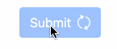
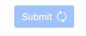

.. _buttons:

======================
Submit Button Controls
======================

In HTML each form must be submitted through a user defined action. This normally is done using
either an input field, or a button with type submit. This ``<button type="submit">`` must be placed
inside the ``<form>...</form>``-element. 

**django-formset** has a different approach. Submit buttons shall be able to do much more than just
triggering an event, which then proceeds with a predefined action on the form. Instead, a button
when clicked, can perform a whole chain of actions. This allows us to trigger more than one event,
whenever a user clicks on a button.

All controlling buttons must be placed inside the ``<django-formset>``-element. A typically submit
button therefore may look like

.. code-block:: django

	<django-formset …>
	  <!-- some forms with fields -->
	  …
	  <button click="disable -> submit -> proceed !~ scrollToError">Submit</button>
	</django-formset>

Action Queues
=============

What we see here are 4 actions, ``disable``, ``submit``, ``proceed`` and ``scrollToError``. Let's go
into details: 

* In ``disable``, the button disables itself. This is useful to prevent double submissions and
  should be used whenever possible.
* In ``submit``, the content of the form(s) inside the ``<django-formset>`` is submitted to the
  server through the given endpoint. This function can take extra values which are submitted along
  with the form data. If for example we use ``submit({foo: "bar"})`` then that extra submit data
  is available in our View entity connected to the given endpoint. That extra submitted data then
  can be accessed by calling ``self.get_extra_data()``. 
* If the submission was successful, ``proceed`` tells the client what to do next. If called without
  parameter, the default is to load the page given by the ``success_url`` in the Django View
  handling the request. If instead we use ``proceed("/path/to/success/page")``, that page is loaded
  on successful form submission. This allows web designers to specify that URL like a link, rather
  than having to rely on a response from the server.

A submission which did not validate on the server is considered as failed and the response status
code is 422, rather than 200. This is where the ``!~`` comes into play. It acts similar to a
catch-statement and everything after that symbol is executed on submission failure.

.. note:: According to `RFC4918 Section 12.1`_, a status code of 422 can be used if a request body
   contains well-formed (i.e., syntactically correct), but semantically erroneous, instructions.
   Even though, the cited RFC applies to XML, invalid form data submitted via JSON can as well be
   interpreted as “semantically erroneous”.

.. _RFC4918 Section 12.1: https://www.rfc-editor.org/rfc/rfc4918#section-11.2

* In ``scrollToError`` the browser scrolls to the first field, which was marked to contain invalid
  input data.

The above 4 functions are the most useful ones, but there are many more functions to be used
together with **django-formset**:

* ``enable`` is used to re-enable a previously disabled button. By default, every button is put into
  the state just before having clicked on it, regardless if the submission was successful or not.
  Therefore this action is rarely of usage.
* ``reset`` is used to reset all form fields to their state when loading the form. It usually should
  be used on a separate button which explicitly is labeled to reset the form.
* ``reload`` this is used to reload the page. Useful to reload the form after a successful
  submission, for instance in buttons labeled “*Save and continue editing*”.
* ``delay(1000)`` delays all further actions by one second. This sometimes can be useful to add an
  extra delay (in milliseconds) during the submission.
* ``spinner`` if the button contains a decorator element, ie. a child with
  ``class="dj-button-decorator"``, then that element is replaced by a rotating spinner symbol.
  Useful to give feedback before time consuming submissions. 
* ``okay`` if the button contains a decorator element, ie. a child with
  ``class="dj-button-decorator"``, then that element is replaced by an animated okay tick. Useful to
  give feedback after a successful form submission. This action takes an optional delay argument in
  milliseconds, in order to visualize the animation before proceeding. 
* ``bummer`` if the button contains a decorator element, ie. a child with
  ``class="dj-button-decorator"``, then that element is replaced by an animated bummer symbol.
  Useful to give feedback after a failed form submission. This action takes an optional delay
  argument in milliseconds, in order to visualize the animation before proceeding.
* ``addClass("foo")`` adds the CSS class "foo" to the button class. After submission, this class is
  automatically removed from the class.
* ``removeClass("foo")`` removes the CSS class "foo" to the button class.
* ``toggleClass("foo")`` toggles the CSS class "foo" on the button class.
* ``emit("event name")`` emit a named event to the DOM.
* ``intercept`` intercepts the response object after submission and prints it onto the console. This
  is only useful for debugging purpose.
* ``clearErrors`` clears all error annotations from a previously failed form validation.
* ``noop`` does nothing and can be used as a placeholder.

By combining these button actions, we gain a huge set of possibilities to improve the user
experience. If for instance, form processing takes more than say one second, we shall somehow
signalize to the user that the submission might take some time. This is where the ``spinner`` action
renders a spinning wheel. After a successful submission, we might want to signalize to the user that
everything is okay, before proceeding to the next page without notification. This is where the
``okay`` action displays an animated tick. In case of an unsuccessful submission attempt, we might
want to signalize to the user that it failed. This is where the ``bummer`` action displays an
animated failure.

This is an example of a ``click`` action on a button for a form requiring some processing time:

.. code-block:: django

	<button type="button" click="disable -> spinner -> submit -> okay(1500) -> proceed !~ enable -> bummer(9999)">
		Submit
		
	</button>

Here we delay the okay tick by 1.5 seconds before proceeding to the next page.

In case of failure, we render the bummer symbol for 10 seconds before resetting it to the default.
