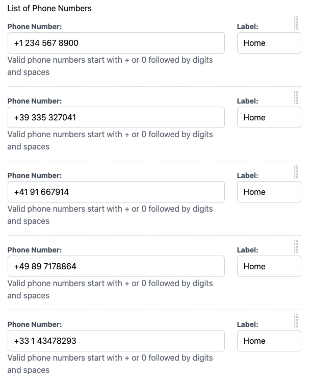

.. _collections:

================
Form Collections
================

A very powerful feature of **django-formset** is the ability to create a collection of forms. In
Django we quite often create forms out of models and want to edit more than one of those forms on
the same page and post them in a single submission. By using a prefix on each Django Form, it is
possible to name the fields uniquely and on submission we can reassign the form data back to each
individual form. This however is limited to one nesting level and in order to add extra forms
dynamically, we must create our own JavaScript function, which is not provided by the Django
framework.

In **django-formset** on the other hand, we can create a form collection and explicitly add existing
forms as members of those collection. It even is possible to add a collection as member of another
collection, in order to build a pseudo nested [#1]_ structure of forms.

The interface for classes inheriting from :class:`formset.collection.FormCollection` is
intentionally very similar to that of a Django ``Form`` class. It can be filled with a ``data``
dictionary as received by a POST request. It also can be initialized with a ``initial`` dictionary.
Since collections can be nested, the ``data`` and ``initial`` dictionaries must contain the same
shape as the nested structure.

Furthermore a ``FormCollection`` offers a ``clean()``-method, which returns a cleaned representation
of the data provided by a client's submission.

Simple Collection
=================

We use this kind of collection, if we just want to group two or more forms together.

.. code-block:: python
	:caption: my_forms.py

	from formset.collection import FormCollection

	class MyFormCollection(FormCollection):
	    form1 = MyForm1()
	    form2 = MyForm2()

.. note::
	The above example will render the form with the default style. To render the form with a specific
	CSS framework you need to specify the ``default_renderer`` attribute on your ``FormCollection``. 

Example:

.. code-block:: python

	from formset.collection import FormCollection
	from formset.renderers.bootstrap import FormRenderer

	class MyFormCollection(FormCollection):
	    default_renderer = FormRenderer()
	    form1 = MyForm1()
	    form2 = MyForm2()
	
All supported CSS frameworks define a ``FormRenderer`` that can be imported with a path similar 
to the one defined in the example, for instance ``formset.renderers.bulma.FormRenderer``, 
``formset.renderers.tailwind.FormRenderer``, etc.

Collections must be rendered using the special View class :class:`formset.views.FormCollectionView`:
The template used to render this Form Collection must ensure that the CSRF-token is set; this is
done by passing that CSRF token value as attribute to the web component ``<django-formset>``.
Otherwise this View just behaves like an ordinary Form View embedded in a **django-formset**.

.. code-block:: django
	:caption: my-collection.html

	<django-formset endpoint="{{ request.path }}" csrf-token="{{ csrf_token }}">
	  {{ form_collection }}
	</django-formset>

Finally add a route to the View:

.. code-block:: python
	:caption: urls.py

	from django.urls import path
	from formset.views import FormCollectionView
	from .my_forms import MyFormCollection

	urlpatterns = [
	    ...
	    path('contact', FormCollectionView.as_view(
	        template_name='my-collection.html'
	        collection_class=MyFormCollection,
	        success_url='/path/to/success',
	    )),
	    ...
	]

Nested Collection
=================

A Form Collection can not only contain other Django Forms, but also other Form Collections. This
means, that we can nest collections into each other up to currently 10 levels (this limit can be
increased if required).

Just as with simple collections, form data sent by the browser is already structured using the same
hierarchy as the collection themselves.

.. _collections-with-siblings:

Collections with Siblings
=========================

If a class inheriting from :class:`formset.collection.FormCollection` contains one of the attributes
``min_siblings``, ``max_siblings`` or ``extra_siblings``, it is considered as a *collection with
siblings*. They then behave similar to what we already know as Django's `InlineModelAdmin objects`_.
The difference though is, that we can use this feature outside of the Django-Admin, and moreover,
that we can nest collections into each other recursively.

.. _InlineModelAdmin objects: https://docs.djangoproject.com/en/stable/ref/contrib/admin/#inlinemodeladmin-objects

Whenever a collection is declared to have siblings, its member collections are rendered from zero,
once or multiple times. For each collection with siblings there is one "Add" button, and for each of
the child collections there is a "Remove" button. To avoid having too many "Remove" buttons, they
are invisible by default and only become visible when moving the cursor over that collection.

.. rubric:: Legend

Just as HTML-elements of type ``<fieldset>`` can contain a legend, a form collection may optionally
also contain a ``<legend>…</legend>``-element. It is placed on top of the collection and shall be
specified as attribute ``legend = "…"`` inside classes inheriting from
:class:`formset.collection.FormCollection`, or as a parameter when initializing the collection.

.. rubric:: Help Text

A form collection may optionally render a ``
…
``- or ``
…
``-element (depending on
the best practices of the CSS framework) at its end, containg a help text string. It shall be
specified as attribute ``help_text = "…"`` inside classes inheriting from
:class:`formset.collection.FormCollection`, or as a parameter when initializing the collection.

.. rubric:: Label for "Add" button

The parameter ``add_label`` shall contain a human readable string, telling the user what kind of
collection to add as sibling. If unset, the "Add" button just contains the **+** symbol.

.. rubric:: Minimum Number of Siblings

The parameter ``min_siblings`` tells us how many collections the parent collection must contain as
minimum. If unset, it defaults to 1.

.. rubric:: Maximum Number of Siblings

The parameter ``max_siblings`` tells us how many collections the parent collection may contain as
maximum. If unset, there is no upper limit.

.. rubric:: Extra Siblings

The parameter ``extra_siblings`` tells us how many empty collections the parent collection starts
with. If unset, it defaults to 0, which means that the user must explicitly add a new sibling by
clicking on the "Add" button below the last sibling.

Note that a collection with siblings behaves differently, when deleting a child collection. If that
child collection was initialized and thus loaded from the server, then it is rendered with a
streaked background pattern, which signalizes to be removed on submission.

.. image:: _static/tailwind-marked-for-deletion.png
  :width: 672
  :alt: Marked for deletion

If on the other side that child collection was just added by clicking on the "Add" button below the
last sibling, then that collection will be deleted immediately. This is because for initialized
collections, while submitting we have to keep a placeholder in order to tell the server how to
change the underlying model.

.. rubric:: Ignore collections marked for removal

Adding the boolean parameter ``ignore_marked_for_removal`` to a class inheriting from
:class:`formset.collection.FormCollection` tells the ``clean()``-method how to proceed with
collections marked for removal. If unset or ``False`` (the default), such collections contain the
special key value pair ``'_marked_for_removal_': True`` inside their returned ``cleaned_data``
structure. This information shall be used, when the backend has to locate the proper model in order
to delete it. If ``ignore_marked_for_removal = True``, then collections marked for removal do not
even appear inside that ``cleaned_data`` structure returned by the ``clean()``-method.

Sortable Collections with Siblings
==================================

Whenever we work with a list of form collections, it might make sense to reorder the given entities.
This allows the user to sort the siblings of a collection. To achieve this, either add
``is_sortable = True`` when declaring the collection class, or instantiate the collection class
by passing ``is_sortable=True`` to its constructor.

Form collections declared to by sortable, render a small drag area on their top right corner. By
dragging that handle, the user can reorder the chosen collections. On form submission, that new
order is reflected inside the list of transferred fields. When using a sortable collection to edit a 
(query-)set of models, it therefore is mandatory to include the primary key of each object as a
hidden input field. Otherwise it will not be possible to resort those objects afterwards in the
database.

One must note that it is only possible to reorder collections inside its direct parent collection.
It therefore is not possible to drag a sub collection into another collection.

.. rubric:: Footnotes

.. [#1] HTML does not allow to nest ``<form>``-elements. However, we can wrap those ``<form>``-s
	into our own web components which themselves are nested and hence mimick that behaviour. 
