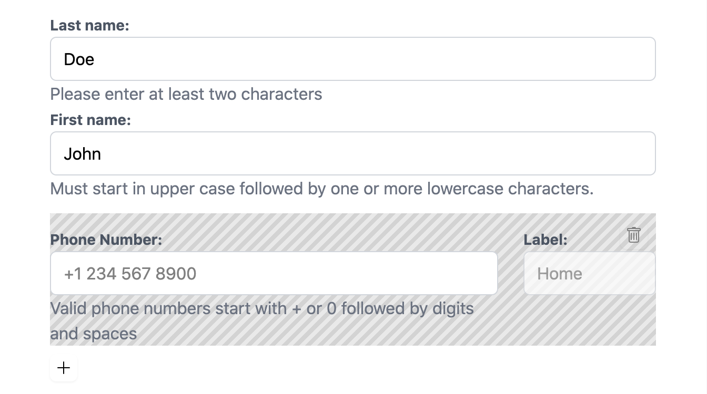

.. _collections:

================
Form Collections
================

A very powerful feature of **django-formset** is the ability to create a collection of forms. In
Django we quite often create forms out of models and want to edit more than one of those forms on
the same page and post them in a single submission. By using a prefix on each Django Form, it is
possible to name the fields uniquely and on submission we can reassign the form data back to each
individual form. This however is limited to one nesting level and is quite cumbersome to handle.

In **django-formset** on the other side, we can create a Form Collection and explicitly add existing
forms as members of those Collection. It even is possible to add a Collection as member of another
Collection, in order to build a nested data structure.

Simple Collection
=================

We use this kind of collection, if we just want to group two or more forms together.

.. code-block:: python
	:caption: my_forms.py

	from formset.collection import FormCollection

	class MyFormCollection(FormCollection):
	    form1 = MyForm1()
	    form2 = MyForm2()

.. note::
	The above example will render the form with the default style. To render the form with a specific
	css framework you need to specify the ``default_renderer`` attribute on your ``FormCollection``. 
	For example :

	.. code-block:: python
		:caption: my_forms.py
	
		from formset.collection import FormCollection
		from formset.renderers.bootstrap import FormRenderer
	
		class MyFormCollection(FormCollection):
		 	default_renderer = FormRenderer()
			form1 = MyForm1()
			form2 = MyForm2()
	
	All supported css frameworks define a ``FormRenderer`` that can be imported with a path similar 
	to the one defined in the example.

Collections must be rendered using the special View class :class:`formset.views.FormCollectionView`:
The template used to render our Form Collection must ensure that the CSRF-Cookie is set; this is
done by accessing the CSRF token. Otherwise this View just behaves like an ordinary Form View
embedded in a **django-formset**.

.. code-block:: django
	:caption: my-collection.html

	<django-formset endpoint="{{ request.path }}">
	  
	  {{ form_collection }}
	</django-formset>

Finally add a route to the View:

.. code-block:: python
	:caption: urls.py

	from django.urls import path
	from formset.views import FormCollectionView
	from .my_forms import MyFormCollection

	urlpatterns = [
	    ...
	    path('contact', FormCollectionView.as_view(
	        template_name='my-collection.html'
	        collection_class=MyFormCollection,
	        success_url='/path/to/success',
	    )),
	    ...
	]

Nested Collection
=================

A Form Collection can not only contain other Django Forms, but also other Form Collections. This
means, that we can nest collections into each other up to currently 10 levels (this limit can be
increased if required).

Just as with simple collections, form data sent by the client is already structured using the same
hierarchy as the collection themselves.

Collections with Siblings
=========================

If a Form Collection contains one of the attributes ``min_siblings``, ``max_siblings`` or
``extra_siblings``, it is considered as a collection with siblings. They then behave similar to
what we already know from Django's `InlineModelAdmin objects`_. The difference though is, that we
can now use this feature outside of the Django-Admin, and that we can nest collections into each
other recursively.

.. _InlineModelAdmin objects: https://docs.djangoproject.com/en/stable/ref/contrib/admin/#inlinemodeladmin-objects

Whenever a collection is declared to have siblings, its member forms are rendered from zero, once or
multiple times. For each collection with siblings there is one "Add" button, and for each of the
child forms/collections there is a "Remove" button. To avoid having too many "Remove" buttons, they
become only visible when moving the cursor over that form/collection.

.. rubric:: Legend

Just as HTML-elements of type``<fieldset>`` can contain a legend, also a Form Collection may
optionally contain a  ``<legend>…</legend>``-element. It is placed on top of the collection and
shall be specified as parameter ``legend = "…"`` inside classes inheriting from
:class:`formset.collection.FormCollection`.

.. rubric:: Minimum Number of Siblings

The parameter ``min_siblings`` tells us how many forms/collections the parent collection shall must
contain as minimum. If unset, it defaults to 1.

.. rubric:: Maximum Number of Siblings

The parameter ``max_siblings`` tells us how many forms/collections the parent collection may contain
as maximum. If unset, there is no upper limit.

.. rubric:: Extra Siblings

The parameter ``extra_siblings`` tells us how many empty forms/collections the parent collection
starts with. If unset, it defaults to 0, which means that the user must explicitly add a new sibling
by clicking on the "Add" button below the last sibling.

Note that a collection with siblings behaves differently, when deleting forms/collections which
either were initialized and thus loaded from the server, or were just added by clicking on the "Add"
button below the last sibling. In the former case, such forms/collections are marked for deletion.
This renders the form with a streaked background pattern, which signalizes to be removed on
submission.

If on the other side, a sibling collection just has been added, it can be removed immediately again.
This is because for initialized forms/collections we have to keep a placeholder in order to tell the
server how to change the underlying model.
