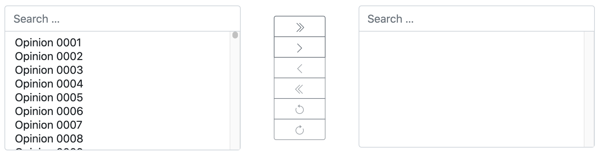

.. _dual-selector:

====================
Dual Selector Widget
====================

This widget usually is used to control the mapping of a many-to-many relation. It consists of two
HTML elements of type ``<select multiple ...>`` placed side by side. The left part contains the
available options to select from, while the right part contains the already selected options.
Between those two select fields, six buttons are located. With the first four, one can move selected
options from left to right and vice versa. The last two buttons can be used to undo and/or redo a
missed assignment.

Features
========

The **DualSelector** widget is well known to Django admin users. There it is named
filter_horizontal_ which is a somehow misleading name. In **django-formset**, this widget however
offers many more features than its Django's counterpart.

.. _filter_horizontal: https://docs.djangoproject.com/en/stable/ref/contrib/admin/#django.contrib.admin.ModelAdmin.filter_horizontal

Asynchronous loading
--------------------

While assigning options, the Django model used to map from, can be huge and contain millions of
entries. In such a situation it would take a lot of resources to load all the options at once.
Therefore **django-formset** only loads a small portion of the available options. By scrolling to
the end of the select element, another chunk of options will be loaded from the server. So in case
the mapping table contains too many options, it is advisable to use the search field located on top
of the select element rather than scrolling down and waiting for the next chunk of options to be
loaded from the server.

Search Fields
-------------

On top of the left- and right select fields, there is one search input field each. While typing,
**django-formset** narrows down the number of available options. Here the left input field sends the
string typed into, to the server performing a remote lookup. Using the database to search for an
entry is much more efficient, rather than doing this using JavaScript inside the browser.

Undo and Redo Buttons
---------------------

While working with these kinds of widgets, it can easily happen to accidentally move the wrong
options. Often the only solution to this is to reset the form and restart over again. By using the
**DualSelector** widget, one can use the undo and redo buttons to switch to the previous selections.

Usage
=====

The **DualSelector** can be used as a widget together with Django's choice fields of type
MultipleChoiceField_ and ModelMultipleChoiceField_. When declaring a form, it shall be added
as widget to the field's arguments

.. code-block:: python

	from django.forms import fields, forms, models, widgets
	from formset.widgets import DualSelector

	class PersonForm(forms.Form):
	    # other fields

	    friends = models.ModelMultipleChoiceField(
	        queryset=Person.objects.all(),
	        widget=DualSelector(search_lookup='name__icontains'),
	    )

Since this field can perform remote lookups, we must tell it how to look for entries in the
database. Here we use a simple Django query lookup string. There is no need for a special
endpoint, but the view handling the form must inherit from
:class:`formset.views.IncompleteSelectResponseMixin`.

.. _MultipleChoiceField: https://docs.djangoproject.com/en/stable/ref/forms/fields/#multiplechoicefield
.. _ModelMultipleChoiceField: https://docs.djangoproject.com/en/stable/ref/forms/fields/#django.forms.ModelMultipleChoiceField

Comparison with SelectizeMultiple
---------------------------------

The **DualSelector** widget can be considered as the big sibling of the :ref:`selectize-multiple`
widget. Both widgets use the same lookup interface and hence can easily be swapped out against each
other, by changing the widget argument in the choice field. 

From a usability point of view, the **SelectizeMultiple** widget probably is easier to understand,
especially for inexperienced users. It is best suited when only a few options (say, less than 15)
shall be selectable together. And since it's much more compact, it shall be used if rendering space
is a concern.

On the other hand, the **DualSelector** widget shall be used whenever the users may select many
options out of a list of options. Therefore this widget does not limit the maximum number of
selectable options. It also might make sense to use this widget, whenever some kind of undo/redo
functionality is required.
