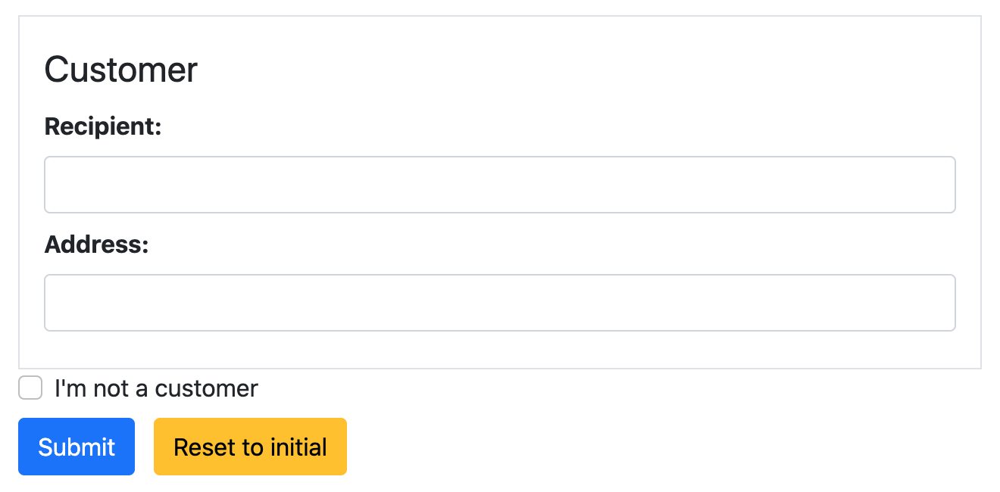

.. _fieldsets:

=========
Fieldsets
=========

In HTML the ``<form>``-element is just a data-abstraction layer. It has no display properties and is
not intended to be styled or annotated. Its purpose is to group one or more input fields, in order
to submit them to the server altogether.

On the other side, we might want to visually group those input fields and optionally add a legend
tag to create a caption for the form. We also might want to group related input fields visually by
surrounding them with a border. For this purpose the HTML standard defines the ``<fieldset>`` tag.
Django itself does not offer any abstraction for this HTML tag. If one wants to use it, this has to
be done on the template level when rendering the form.

To fill this gap, **django-formset** introduces a Python class to handle the Fieldset element. From
a technical point of view, a fieldset behaves exactly like a single form and in HTML it always is
wrapped inside a ``<form>``-element. If we want to use more than one fieldset, then we have to group
them using :ref:`collections`, just as we would do with normal forms.

Another purpose of using fieldsets, appart from adding a border and legend to a form, is to use
:ref:`conditionals`. This allows us to hide or disable the whole fieldset depending on the context
of other fields.

Example
=======

In this example we use two forms nested in a ``FormCollection``. Remember, a ``Fieldset`` behaves
exactly as a ``Form`` instance and can be used as a replacement, although with additional styling
possibilities.

.. code-block:: python

	from django.forms import fields, forms
	from formset.fieldset import Fieldset
	from formset.collection import FormCollection
	
	class CustomerForm(Fieldset):
	    legend = "Customer"
	    hide_if = 'register.no_customer'
	    recipient = fields.CharField()
	    address = fields.CharField()
	
	class RegisterForm(forms.Form):
	    no_customer = fields.BooleanField(
	        label="I'm not a customer",
	        required=False,
	    )
	
	class CustomerCollection(FormCollection):
	    customer = CustomerForm()
	    register = RegisterForm()

When rendered, this Form Collection may look like:

The interesting part of this collection is, that we can hide the Fieldset by clicking on the
checkbox named "I'm not a customer". This means, that by using conditionals, we can dynamically
adjust the visibility of a complete form.
