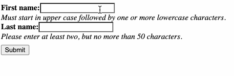

.. _intro:

Introduction
============

Consider having a standard Django Form instance, say 

.. code-block:: python

	from django.forms import forms, fields
	
	class SomeForm(forms.Form):
	    name = 'person'
	
	    some_field = fields.CharField(...)

In Django, we typically render an instance of the above form using a template rendered by a
FormView_. With this approach, data entered into the form fields must be send to the server for
validation. If one or more of those fields fail to validate, the form is re-rendered, annotating
the fields containing invalid data. The latter requires to fully reload the whole page.
Looking at modern JavaScript frameworks, it is obvious that this approach isn't contemporary
anymore.

The solution we typically use nowadays, is to send the form's data to the server using an
XMLHttpRequest_ (Ajax), validate it and if that fails, display the validation errors nearby the
offending fields. This can be done without reloading the page.

By using Django's REST framework and some third party JavaScript tools, we can already evolve our
input forms into such a behaviour. This however requires to rewrite our forms as DRF serializers,
giving up many of the nice features we are used to, when using the Django form framework.

With **django-formset** instead we can use the above Django form and render it using a slightly
modified template, such as:

.. code-block:: django

	

	<django-formset endpoint="{{ request.path }}">
	    <form name="{{ form.name }}">
	        
	        
	    </form>
	    <button type="button" click="submit">Submit</button>
	</django-formset>

There are a few things, which admittedly, may seem unusual to us:

* The ``<form>`` tag neither contains a ``method`` nor an ``action`` attribute.
* The submit button is located outside the form.

Instead we wrap the form(s) into a HTML element named ``<django-formset>``. This is because this
special webcomponent_ can wrap one or more forms into such a "formset". The content of those forms 
then is submitted to a central endpoint provided by our Django application. When using Django's
internal formset_, the field names have to be prefixed with identifiers to distinguish their form
affiliation. This is cumbersome and difficult to understand. By using **django-formset**, we can
keep the field names, since our wrapper groups into plain JavaScript objects for each submitted
form.

The JavaScript classes behind this component now handles the following functions:

* Client-side validaton of our form fields using the constraints defined by our form.
* Serializes the data entered into our form fields.
* Handles the submission of that data, by sending it to the server's ``endpoint``.
* Receives server-side validation annotations and marks all fields containing incorrect data.
* On success, performs a different action, usually a redirect onto a success page.
* Handles various actions after the user clicked on the button. This is useful to make the button
  behave more interactively.

Interacting with that form, shows validation errors immediatly:

Form data submitted by the webcomponent ``<django-formset>`` is not send using the default enctype_
``application/x-www-form-urlencoded``. Instead the data from all forms is packed together into a
JavaScript object and submitted to the server using the enctype ``application/json``. This means
that our receiving form view, requires a slightly different handler. The easyest way is to add
the mixin class :class:`formset.views.FormsetViewMixin` to the existing view class handling our
forms.

.. _FormView: https://docs.djangoproject.com/en/stable/topics/class-based-views/generic-editing/
.. _XMLHttpRequest: https://developer.mozilla.org/en-US/docs/Web/API/XMLHttpRequest
.. _webcomponent: https://www.webcomponents.org/introduction
.. _formset: https://docs.djangoproject.com/en/stable/topics/forms/formsets/#formsets
.. _enctype: https://developer.mozilla.org/en-US/docs/Learn/Forms/Sending_and_retrieving_form_data#the_enctype_attribute
