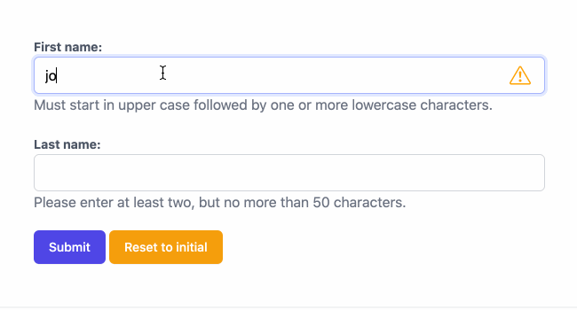

.. _intro:

Django-4.0 introduced a long awaited feature to render form fields using a template. Until version
3.2 this was left to the infamous function ``BaseForm._html_output()``, which rendered the form
fields hard-coded in HTML and hence there was little scope for modification. This new feature now
makes it possible to write special renderers for adding functionality as implemented by this
library.

============
Introduction
============

**django-formset** tries to solve a problem, which occurs in almost every project using the
Django framework: The way forms are handled. Compared to the solutions most modern JavaScript
frameworks offer nowadays, having to reload a page if a form does not validate, is *not*
contemporary anymore. Therefore, Django developers often use a combination of one of these client
frameworks together with the `Django REST framework`_, which then indeed provides a much better User
eXperience. However, those JavaScript frameworks impose their own way of getting stuff done and
usually don't share the same mindset with Django. For instance, in Django we distinguish between
`bound and unbound forms`_. This concept however doesn't make sense in most JavaScript
frameworks, and hence is not implemented. We therefore often must work around those problems, which
leads to cumbersome and un-`DRY`_ solutions.

.. _Django REST framework: https://www.django-rest-framework.org/
.. _bound and unbound forms: https://docs.djangoproject.com/en/stable/ref/forms/api/#bound-and-unbound-forms
.. _DRY: https://www.artima.com/articles/orthogonality-and-the-dry-principle

With **django-formset** we get a `web component`_ explicitly written to handle Django forms and
collections of forms (hence "formset") *with* the User eXperience only modern JavaScript frameworks
can offer. This means that fields are validated by the client, giving immediate feedback on invalid
field values. If the form's content then is sent to the server and fails to validate there, those
error messages are sent back to the client and show up nearby the fields containing invalid data.
Giving feedback on a form which did not validate doesn't require a page reload anymore. The nice
thing about this approach is, that we **can reuse all of our current Django forms** (unaltered),
**can use our existing Django views** (with a small modification), but **neither have to add any
extra code nor endpoints to the URL routing** of our application.

.. _web component: https://developer.mozilla.org/en-US/docs/Web/Web_Components

.. _forms_as_logical_entities:

Use Forms as Logical Entities
=============================

The **django-formset** library separates the logical layer of a Django Form_ from their HTML entity
``<form>``.

What does that mean? In Django we can define a form as a group of fields with certain data-types.
Often these forms are derived from a Django model. On the client, this form then is rendered, can
be filled with data and submitted back to the server.

Typically there is one form per page, because the HTML standard does not allow you to submit more
than one form in one submission. With the introduction of FormSets_, Django provides a workaround
for this use-case. It however relies on prefixing each field from the forms making up a "FormSet"
with a unique identifier, so that those Django forms can be wrapped into one HTML
``<form>``-element. This makes the handling of multiple forms per page cumbersome and difficult to
understand.

By using **django-formset** on the other hand, each Django form corresponds to its own
self-contained ``<form>``-element. Inside each of these forms, all field names remain unmodified
and on submission, each form introduces its own namespace, so that the form data is submitted as a
dictionary of field-value-pairs. By doing so, we can even nest forms deeply, something currently
not possible with Django FormSets_.

.. _Form: https://docs.djangoproject.com/en/stable/topics/forms/
.. _FormSets: https://docs.djangoproject.com/en/stable/topics/forms/formsets/

.. rubric:: Example

Consider having a standard Django Form instance, say 

.. code-block:: python

	from django.forms import forms, fields
	
	class RegisterPersonForm(forms.Form):
	    first_name = fields.RegexField(
	        r'^[A-Z][a-z -]+$',
	        label="First name",
	        error_messages={'invalid': "A first name must start in upper case."},
	        help_text="Must start in upper case followed by one or more lowercase characters.",
	    )

	    last_name = fields.CharField(
	        label="Last name",
	        min_length=2,
	        max_length=50,
	        help_text="Please enter at least two, but no more than 50 characters.",
	    )

	    def clean(self):
	        """
	        Raise a ValidationError for undesirable persons.
	        """
	        ...

In Django, we typically render an instance of the above form using a template rendered by a
FormView_. With this approach, data entered into the form fields must be sent to the server for
validation. If one or more of those fields fail to validate, the form is re-rendered, annotating the
fields containing invalid data with some error messages. The latter would require to fully reload
the whole page. Looking at modern JavaScript frameworks, it is obvious that this approach isn't
contemporary anymore.

	Interacting with that form, shows validation errors immediately.

With the web component ``<django-formset>`` we instead can use the above Django form and render it
using a slightly modified Django view and a template such as

.. code-block:: django

	

	<django-formset endpoint="{{ request.path }}" csrf-token="{{ csrf_token }}">
	  
	  <button type="button" click="submit">Submit</button>
	  <button type="button" click="reset">Reset to initial</button>
	</django-formset>

When looking at the rendered HTML code, there are a few things, which admittedly, may seem unusual
to us:

* What is that ``<django-formset>`` HTML element?
* The ``<form>`` tag neither contains a ``method`` nor an ``action`` attribute.
* The "Submit" and "Reset" buttons are located outside of the ``<form>`` element.

In this example we wrap the form into a special HTML element named ``<django-formset>``. This
web component then is used to embed one or more ``<form>`` elements. The content of those form
fields then is submitted to the same endpoint in our Django application, which is responsible for
rendering that form.

.. note:: When using Django's internal formset_, the field names have to be prefixed with
	identifiers to distinguish their form affiliation. This is cumbersome and difficult to debug.
	By using **django-formset**, we can keep the field names, since our wrapper groups them into
	plain JavaScript objects.

In this example, the form is rendered by the special templatetag ````. This
templatetag can be parametrized to use the correct style-guide for each of the supported CSS
frameworks. It can also be used to pass in our own CSS classes for labels, fields and field groups.
More on this can be found in chapter :ref:`native_form`.

It also is possible to render the form using the classic approach with mustaches, ie.
``{{ form }}``. Then however the form object can't be a native Django form. Instead it has to be
transformed using a special mixin class. More on this can be found in chapter :ref:`extended_form`.

Another approach is to render the form field-by-field. Here we gain full control over how each field
is rendered, since we render them individually. More on this can be found in chapter
:ref:`field_by_field`.

What are Web Components?
========================

According to `webcomponents.org`_, web components are a set of web platform APIs that allow you to
create new custom, reusable, encapsulated HTML tags to use in web pages and web apps. Custom
components and widgets built upon the web component standards, will work across modern browsers,
and can be used with any JavaScript library or framework that works with HTML.

Web components are based on existing web standards. Features to support web components are currently
being added to the HTML and DOM specs, letting web developers easily extend HTML with new elements
with encapsulated styling and custom behavior.

The JavaScript behind this component now handles the following functions:

* Client-side validation of our form fields using the constraints defined by our form.
* Serializes the data entered into our form fields.
* Handles the submission of that data, by sending it to the server's ``endpoint``.
* Receives server-side validation annotations and marks all fields containing incorrect data.
* On success, performs a different action, usually a redirect onto a success page.
* Handles various actions after the user clicked on the button. This is useful to make the button
  behave more interactively.

.. note:: Form data submitted by the web component ``<django-formset>`` is not send using the
	default enctype_ ``application/x-www-form-urlencoded``. Instead the data from all forms is
	packed together into a JavaScript object and submitted to the server using enctype
	``application/json``. This means that our Django view receiving the form data, must be able to
	process that data using a slightly modified handler.

.. _FormView: https://docs.djangoproject.com/en/stable/topics/class-based-views/generic-editing/
.. _XMLHttpRequest: https://developer.mozilla.org/en-US/docs/Web/API/XMLHttpRequest
.. _webcomponents.org: https://www.webcomponents.org/introduction
.. _formset: https://docs.djangoproject.com/en/stable/topics/forms/formsets/#formsets
.. _enctype: https://developer.mozilla.org/en-US/docs/Learn/Forms/Sending_and_retrieving_form_data#the_enctype_attribute

Annotation
==========

When designing this library, one of the main goals was to **keep the programming interface as near
as possible to the way Django handles forms, models and views**. It therefore is possible to reuse
existing Django form declarations with a minimal modification to existing code.

Contributing
============

Please read chapter :ref:`contributing` before opening issues or pull requests.

