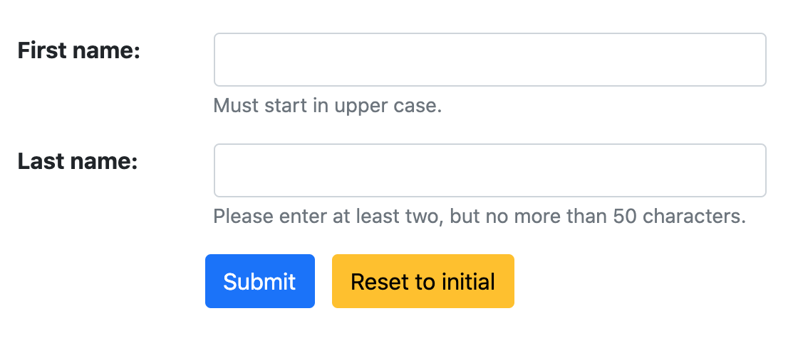

.. _renderers:

==============
Form Renderers
==============

Since Django-4.0 each form can specify its own renderer_. This is important, because it separates
the representation layer from the logical layer of forms. And it allows us to render the same form
for different CSS frameworks without modifying a single field. The only thing we have to do, is to
replace the form renderer with an alternative one.

.. _renderer: https://docs.djangoproject.com/en/4.0/ref/forms/renderers/#the-low-level-render-api

Form Grid Example
-----------------

Say, we have a form to ask for the recipient's address:

.. code-block:: python

	from django.forms import forms, fields
	
	class AddressForm(forms.Form):
	    recipient = fields.CharField(
	        label="Recipient",
	        max_length=100,
	    )
	
	    postal_code = fields.CharField(
	        label="Postal Code",
	        max_length=8,
	    )

	    city = fields.CharField(
	        label="City",
	        max_length=50,
	    )

this form, typically be rendered using a template such as

.. code-block:: django

	

	<django-formset endpoint="{{ request.path }}" csrf-token="{{ csrf_token }}">
	  
	  

	    <button type="button" click="submit -> proceed" class="btn btn-primary">Submit</button>
	    <button type="button" click="reset" class="ms-2 btn btn-warning">Reset to initial</button>
	  

	</django-formset>

Usually we prefer to keep the postal code and the destination city on the same row. When working
with the Bootstrap framework, we therefore want to use the `form grid`_ for form layouts that
require multiple columns, varied widths, and additional alignment options.
We therefore have to add the CSS classes ``row`` and ``col-XX`` to the wrapping elements, while
rendering the form. One possibility would be to create a template and style each fields
individually; this is the method described in :ref:`field_by_field`. This however requires to create
a template for each form, which contradicts the DRY-principle.

.. _form grid: https://getbootstrap.com/docs/5.0/forms/layout/#form-grid

We therefore parametrize the provided renderer class. For each supported CSS framework, there is a
Form Renderer. For Bootstrap, that class can be found at
:class:`formset.renderers.bootstrap.FormRenderer`.

We now can add that renderer to the above form class and parametrize it as follows

.. code-block:: python

	from formset.renderers.bootstrap import FormRenderer

	class AddressForm(forms.Form):
	    default_renderer = FormRenderer(
	        form_css_classes='row',
	        field_css_classes={'*': 'mb-2 col-12', 'postal_code': 'mb-2 col-4', 'city': 'mb-2 col-8'},
	    )

	    # form fields as above

When rendered in a Bootstrap-5 environment, that form will look like

Here we pass a few CSS classes into the renderer. In ``form_css_classes`` we set the CSS class added
to the ``<form>`` element itself. In ``field_css_classes`` we set the CSS classes for the field
groups. If this is a string, the given CSS classes are applied to each field. If it is a dictionary,
then we can apply those CSS classes to each field individually, by using the field's name as
dictionary key. The key ``*`` stands for the fallback and its value is applied to all fields which
are not explicilty listed in that dictionary.

Inline Form Example
-------------------

By using slightly different parameters, a form can be rendered with labels and input fields side
by side, rather than beneath each other. This can simply be achieved by replacing the form renderer
using these parameters.

.. code-block:: python

	from formset.renderers.bootstrap import FormRenderer

	class AddressForm(forms.Form):
	    default_renderer = FormRenderer(
	        field_css_classes='row mb-3',
	        label_css_classes='col-sm-3',
	        control_css_classes='col-sm-9',
	    )

	    # form fields as above

When rendered in a Bootstrap-5 environment, that form will look like

The same effect can be achieved by rendering this form, parametrizing our well known templatetag:

.. code-block:: django

	<django-formset endpoint="{{ request.path }}" csrf-token="{{ csrf_token }}">
	  
	  

	    <button type="button" click="submit -> proceed" class="btn btn-primary">Submit</button>
	    <button type="button" click="reset" class="ms-2 btn btn-warning">Reset to initial</button>
	  

	</django-formset>
