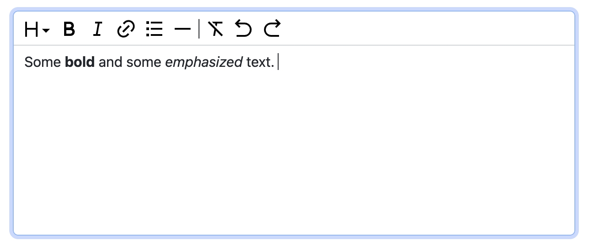

.. _rich-textarea:

=============
Rich Textarea
=============

A Rich Textarea allows editing or pasting formatted text, similar to traditional "What you see is
what you get" (WYSIWYG) editors. The current implementation offers common text formatting options
such as paragraphs, headings, emphasised and bold text, ordered and bulleted lists, and hyperlinks.
More text formating options will be implemented in the future.

The **django-formset** library provides a widget, which can be used as a drop in replacement for the
HTML element ``<textarea>``, imlemented as webcomponent. In a Django form's ``CharField``, we just
have to replace the built-in widget against :class:`formset.richtext.widgets.RichTextarea`.

.. code-block:: python

	from django.forms import fields, forms
	from formset.richtext.widgets RichTextarea

	class SomeForm(forms.Form):
	    text = fields.CharField(widget=RichTextarea)

This widget can be configured in various ways in order to specifically enable the currently
implemented formatting options. With the default settings and using the Bootstrap renderer, this
textarea will show up like:

Configuration
=============

When offering a rich textarea, the default formatting options may not be appropriate. Therefore,
the widget class ``RichTextarea`` can be configured using various control elements.

.. code-block:: python

	from formset.richtext import controls
	from formset.richtext.widgets RichTextarea

	richtext_widget = RichTextarea(control_elements=[
	    controls.Bold(),
	    controls.Italic(),
	])

This configuration would only allow to format text using **bold** and *italic*. Currently
**django-formset** implements these formating options:

.. rubric:: Heading

The class :class:`formset.richtext.controls.Heading` can itself be configured using a list of levels
from 1 through 6. For instance ``Heading([1, 2, 3])`` allows to format a heading by using the HTML
tags ``<h1>``,  ``<h2>`` and  ``<h3>``. If provided without parameters, all 6 possible heading
levels will be available. If only one level is provided, for instance as ``Heading(1)``, then the
heading button does not provide pull down menu, but instead is rendered as a single **H1** button.
This allows to place heading buttons for different levels on the toolbar side by side.

.. rubric:: Bold

The class :class:`formset.richtext.controls.Bold` can be used to format a selected part of the text
in bold variant of the font. It can't be further configured.

.. rubric:: Italic

The class :class:`formset.richtext.controls.Italic` can be used to format a selected part of the
text in an emphazised (italic) variant of the font. It can't be further configured.

.. rubric:: Underline

The class :class:`formset.richtext.controls.Underline` can be used to format a selected part of the
text as underlined. This option rarely makes sense. It can't be further configured.

.. rubric:: BulletList

The class :class:`formset.richtext.controls.BulletList` can be used to format some text as bulleted
list. It can't be further configured.

.. rubric:: OrderedList

The class :class:`formset.richtext.controls.OrderedList` can be used to format some text as ordered
(ie. numbered) list. It can't be further configured.

.. rubric:: HorizontalRule

The class :class:`formset.richtext.controls.HorizontalRule` can be used to add a horizontal rule
between paragraphs of text. It can't be further configured.

.. rubric:: ClearFormat

The class :class:`formset.richtext.controls.ClearFormat` can be used to remove the current format
settings of selected text. It can't be further configured.

.. rubric:: Undo and Redo

The classes :class:`formset.richtext.controls.Undo` and :class:`formset.richtext.controls.Redo` can
be used to undo and redo changes on the current text. They can't be further configured.

.. rubric:: Link

The class :class:`formset.richtext.controls.Link` can be used to add a hyperlink to a selected part
of some text. When choosing this option, a modal dialog pops up and the user can enter a URL.

.. rubric:: Separator

The class :class:`formset.richtext.controls.Separator` has no functional purpose. It can be used
to separate the other buttons visually using a vertical bar.

Implementation
==============

This richtext area is based on the `Tiptap framework`_. This framework offers many more formatting
options than currently implemented by the **django-formset** library. Please read how to contribute
when adding a new formatting option.

.. _Tiptap framework: https://tiptap.dev/

Richtext as a Model Field
=========================

In the example from above, we used a Django form ``CharField`` and replaced the default widget. A
more common use case is to store the entered rich text in a database field. Here **django-formset**
offers two solutions:

.. rubric:: Using HTML

Storing rich text as HTML inside the database using the field `django.db.models.fields.TextField`_  
is the simplest solution. It however requires to override the default widget (``Textarea``) against
the ``RichTextarea`` provided by this library, when instantiating the form associated with this
model.

.. _django.db.models.fields.TextField: https://docs.djangoproject.com/en/stable/ref/models/fields/#textfield

If the content of such a field shall be rendered inside a Django template, do not forget to mark
it as "safe", either by using the function `django.utils.safestring.mark_safe`_ or by using the
template filter `{{ …|safe }}`_.

.. _django.utils.safestring.mark_safe: https://docs.djangoproject.com/en/stable/ref/utils/#django.utils.safestring.mark_safe
.. _{{ …|safe }}: https://docs.djangoproject.com/en/4.1/ref/templates/builtins/#safe

.. rubric:: Using JSON

