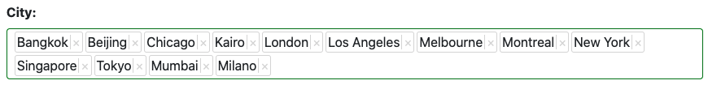
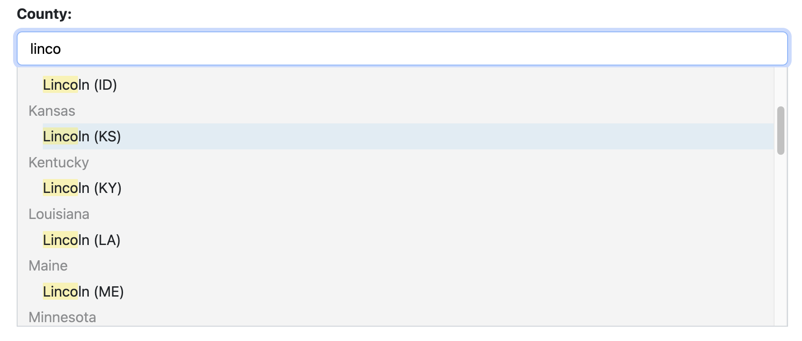

.. _selectize:

================
Selectize Widget
================

Rendering choice fields using a ``<select>``-element becomes quite impractical when there are too
many options to select from. For this purpose, the Django admin backend offers so-called
`auto complete fields`_, which loads a filtered set of options from the server as soon as the user
starts typing into the input field. This widget is based on the Select2_ plugin, which itself
depends upon jQuery, and hence it is not suitable for **django-formset** which aims to be JavaScript
framework agnostic.

.. _auto complete fields: https://docs.djangoproject.com/en/stable/ref/contrib/admin/#django.contrib.admin.ModelAdmin.autocomplete_fields
.. _Select2: https://select2.org/

Usage with fixed Number of Choices
----------------------------------

Assume, we have an address form defining a ChoiceField_ to choose from a city. If this number of
cities exceeds say 25, we should consider to render the select box using the special widget
:class:`formset.widgets.Selectize`:

.. _ChoiceField: https://docs.djangoproject.com/en/stable/ref/forms/fields/#django.forms.ChoiceField 

.. code-block:: python

	from django.forms import fields, forms, widgets
	from formset.widgets import Selectize

	class AddressForm(forms.Form):
	    # other fields

	    city = fields.ChoiceField(
	        choice=[(1, "London"), (2, "New York"), (3, "Tokyo"), (4, "Sidney"), (5, "Vienna")],
	        widget=Selectize,
	    )

This widget waits for the user to type some characters into the input field for "``city``". If the
entered string matches the name of one or more cities (even partially), then a list of options is
generated containing the matching cities. By adding more characters to the input field, that list
will shrink to only a few or eventually no entry. This makes the selection simple and comfortable.

Usage with dynamic Number of Choices
------------------------------------

Sometimes we don't want to handle the choices using a static list. For instance, when we store them
in a Django model, we point a foreign key onto the chosen entry of that model. The above example
then can be rewritten by replacing the ChoiceField_ against a ModelChoiceField_. Instead of
``choices`` this field then requires an argument ``queryset``. For the form we defined above, we
use a Django model named ``Cities`` with ``name`` as identifier. All cities we can select from,
are now stored in a database table.

.. _ModelChoiceField: https://docs.djangoproject.com/en/stable/ref/forms/fields/#django.forms.ModelChoiceField 

.. code-block:: python

	from django.forms import fields, forms, models, widgets
	from formset.widgets import Selectize

	class AddressForm(forms.Form):
	    # other fields

	    city = models.ModelChoiceField(
	        queryset=Cities.objects.all(),
	        widget=Selectize(
	            search_lookup='name__icontains',
	            placeholder="Choose a city",
	        ),
	    )

Here we instantiate the widget :class:`formset.widgets.Selectize` using the following arguments:

* ``search_lookup``: A Django `lookup expression`_. For choice fields with more than 50 options,
  this instructs the **django-formset**-library on how to look for other entries in the database. 
* ``placeholder``: The empty label shown in the select field, when no option is selected.
* ``attrs``: A Python dictionary of extra attributes to be added to the rendered ``<select>``
  element.

.. _lookup expression: https://docs.djangoproject.com/en/stable/ref/models/lookups/#lookup-reference

Endpoint for Dynamic Queries 
----------------------------

In comparison to other libraries offering autocomplete fields, such as `Django-Select2`_,
**django-formset** does not require adding an explicit endpoint to the URL routing. Instead it
shares the same endpoint for form submission as for querying for extra options out of the database.
This means that the form containing a field using the ``Selectize`` widget *must* be controlled by
a view inheriting from :class:`formset.views.IncompleteSelectResponseMixin`.

.. note:: The default view offered by **django-formset**, :class:`formset.views.FormView` already
	inherits from ``IncompleteSelectResponseMixin``.

.. _Django-Select2: https://django-select2.readthedocs.io/en/latest/

Implementation Details
----------------------

The client part of the ``Selectize`` widget relies on Tom-Select_ which itself is a fork of the
popular `Selectize.js`_-library, but rewritten in pure TypeScript and without any other external
dependencies. This made it suitable for the client part of **django-formset**, which itself is a
self-contained JavaScript library compiled out of TypeScript.

.. _Tom-Select: https://tom-select.js.org/
.. _Selectize.js: https://selectize.dev/

.. _selectize-multiple:

SelectizeMultiple Widget
========================

If the form field for "``city``" shall accept more than one selection, in Django we replace it by a
:class:`django.forms.fields.MultipleChoiceField`. The widget then used to handle such an input field
also must be replaced. **django-formset** offers the special widget
:class:`formset.widgets.SelectizeMultiple` to handle more than one option to select from. From a
functional point of view, this behaves similar to the Selectize widget described before. But instead
of replacing a chosen option by another one, selected options are lined up to build a set of
options.

By default a ``SelectizeMultiple`` widget can accept up to 5 different options. This limit can be
adjusted by increasing the argument of ``max_items``. This value however shall not exceed more than
say 15 items, otherwise the input field might become unmanageable. If you need a multiple select
field able to accept hundreds of items, consider using the :ref:`dual-selector` widget.

Handling ForeignKey and ManyToManyField
=======================================  

If we create a form out of a Django model, we explicitly have to tell it to either use the
``Selectize`` or the ``SelectizeMultiple`` widget. Say that we have an address model using 
a foreign key to existing cities

.. code-block:: python

	from django.db import models

	class AddressModel(models.Model):
	    # other fields
	
	    city = models.ForeignKey(
	        CityModel,
	        verbose_name="City",
	        on_delete=models.CASCADE,
	    )

then when creating the corresponding Django form, we must replace the default widget ``Select``
against our special widget ``Selectize``:

.. code-block:: python

	from django.forms import models
	from formset.widgets import Selectize

	class AddressForm(models.ModelForm):
	    class Meta:
	        model = AddressModel
	        fields = '__all__'
	        widgets = {
	            # other fields
	            'city': Selectize(search_lookup='label__icontains'),
	        }

The argument ``search_lookup`` is used to build the search query.

If we want to allow the user to select more than one city, we have to replace the ``ForeignKey``
against a ``ManyToManyField`` – and conveniently rename "city" to "cities". Then in the above
example, we'd have to replace the ``Selectize`` widget against ``SelectizeMultiple``:

.. code-block:: python

	from django.forms import models
	from formset.widgets import SelectizeMultiple

	class AddressForm(models.ModelForm):
	    class Meta:
	        model = AddressModel
	        fields = '__all__'
	        widgets = {
	            # other fields
	            'cities': SelectizeMultiple(search_lookup='label__icontains'),
	        }

Remember that the view connecting this form must inherit from
:class:`formset.views.IncompleteSelectResponseMixin`. This mixin class also handles the Ajax
endpoint for the :ref:`dual-selector`. Therefore, the only task we have to do when switching from a
``SelectizeMultiple`` to a ``DualSelector`` widget, is to rewrite the widget mapping in the form's
``Meta``-class.

Grouping Options
================  

Sometimes it may be desirable to group options the user may select from. As an example, consider the
use case where we want to choose a county in the United States. Here we use two models with a simple
relationship:

.. code-block:: python
	:caption: models.py

	class State(models.Model):
	    code = models.CharField(max_length=2)
	
	    name = models.CharField(
	        max_length=20,
	        db_index=True,
	    )
	
	    class Meta:
	        ordering = ['name']
	
	    def __str__(self):
	        return self.name
	
	
	class County(models.Model):
	    state = models.ForeignKey(
	        State,
	        on_delete=models.CASCADE,
	    )
	
	    name = models.CharField(max_length=30)
	
	    class Meta:
	        ordering = ['state', 'name']
	
	    def __str__(self):
	        return f"{self.name} ({self.state.code})"

Since there are 3143 counties, many of them using the same name, it would be really confusing to
show them in a simple list of options. Instead we typically would render them grouped by state. To
achieve this, we have to tell the field ``county`` how to group them, by using the attribute
``group_field_name``. This sets up the ``Selectize``-widget to use the named field from the model
specified by the queryset for grouping.

.. code-block:: python
	:caption: forms.py

	class AddressForm(models.ModelForm):
	    # other fields

	    county = models.ModelChoiceField(
	        queryset=County.objects.all(),
	        widget=Selectize(
	            search_lookup='name__icontains',
	            group_field_name='state',
	        ),
	    )

When rendered, the ``<option>`` elements then are grouped inside ``<optgroup>``-s using the state's
name as their label:

