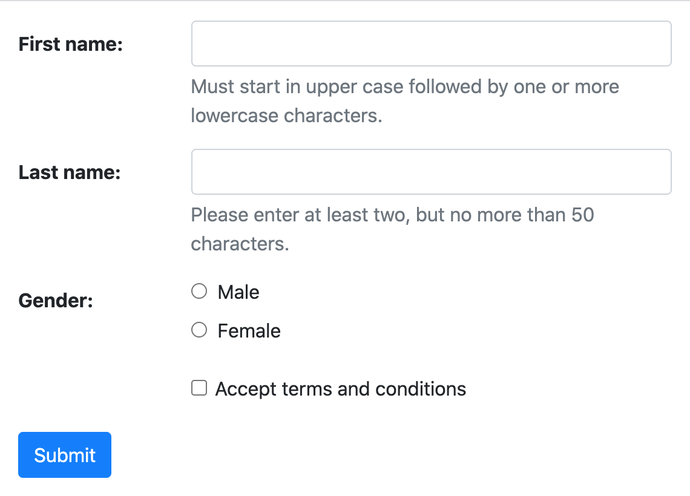

.. _single-form:

**To be documented**

Using django-formset
====================

**django-formset** ships with three types of renderers, suitable for most uses. Say, we have defined
a Django form, then we would have these options on how to render it:

.. _native_form:

Using a Native Django Form
--------------------------

.. _extended_form:

Using an Extended Django Form
-----------------------------

.. _field_by_field:

Render a Django Form Field-by-Field
-----------------------------------

* Rendering the form using the special template tag ``render_groups``.
* Using the special mixin class ``FormMixin`` from which the form declaration inherits. 
* Using the template filter ``formsetify`` when iterating over the form fields. 

We choose one of these, depending on wheather we want to adopt the template used to render the form,
or otherwise prefer to change the form definition class. Either way the outcoming result is the
same. These three alternatives exists for all supported formset styles: Default, Bootstrap, Bulma,
Foundation and Tailwind.

Common to all renderers, is the declaration of a Django Form instance. In this documentation, we
will to the following sample implementation:

.. code-block:: python

	from django.forms import forms, fields
	
	class PersonForm(forms.Form):
	    name = 'person'
	
	    first_name = fields.RegexField(
	        r'^[A-Z][a-z -]+$',
	        label="First name",
	        error_messages={'invalid': "A first name must start in upper case."},
	        help_text="Must start in upper case followed by one or more lowercase characters.",
	    )
	
	    last_name = fields.CharField(
	        label="Last name",
	        min_length=2,
	        max_length=50,
	        help_text="Please enter at least two, but no more than 50 characters.",
	    )

	    gender = fields.ChoiceField(
	        label="Gender",
	        choices=[('m', "Male"), ('f', "Female")],
	        widget=widgets.RadioSelect,
	        error_messages={'invalid_choice': "Please select your gender."},
	    )

	    accept = fields.BooleanField(
	        label="Accept terms and conditions",
	        initial=False,
	    )

Webcomponent ``<django-formset>``
=================================

When this form is rendered using a Django template, keep in mind that it must be wrapped inside
our webcomponent ``<django-formset>``. This component then takes care of the client-part, such
as the form validation, submission and many other features.

We must set an ``endpoint``, where the client-part can communicate with our Django server.
The attribute ``endpoint`` therefore is mandatory for each ``<django-formset>``. It shall contain
a URL pointing onto a view, which handles our Django formset.

An optional attribute to our webcomponent ``<django-formset>`` is ``force-submission``. By setting
this to ``true``, we can force a submission to the server, even if the form did not validate on the
client side. This attribute defaults to ``false``, meaning that forms, which did not validate
can not be submitted to the server.

Another optional attribute to our webcomponent ``<django-formset>`` is ``withhold-messages``. By
setting this to ``true``, we can withhold validation error messages until the user submits the form.
This attribute defaults to ``false``, meaning that a validation error message is shown immediatly
after the user leaves a field containig invalid data.

Default Styling
===============

The default **django-formset** styling intentionally renders all the fields as the browser would by
default. This admiditly looks very rough and we only use it, if we want to style every aspect of our
web site. This requires to write the CSS ourselfs. If we use one of the known CSS frameworks, then
instead we will proceed with one of the specialized renderes. The concept for these three rendering
functions remains to same, independently of the CSS framework.

When rendered by Django, that form displays two text input fields, one for the person's first- and
its last name. Here we declared two constraints on the first two fields: The first name must start
in upper case and contain at least one additional character in lower case, while the last name must
consist from at least two, but no more than 50 characters. Additionally the user has to choose his
gender using two radio input fields and a mandatory checkbox input to accept the terms and
conditions.

Templatetag ``render_groups``
-----------------------------

This probably is the simplest recipe to render to above form. Here we use the templatetag
```` to render all fields wrapped inside their field-groups.

.. code-block:: django

	

	<django-formset endpoint="/path/to/endpoint">
	   <form name="{{ form.name }}">
	      
	      
	   </form>
	   <button type="button" click="submit">Submit</button>
	</django-formset>

We use this method, if we want to keep the form declaration separate from the rendering logic.

Always remember to add

.. code-block:: django

	

anywhere inside the ``<head>``-element of the page.

Filter ``formsetify`` with templatetag ``render_group``
-------------------------------------------------------

If we need more fine grained control over how individual fields are rendered, then this recipe
suits best:

.. code-block:: django

	
	
	
	<django-formset endpoint="/path/to/endpoint">
	   <form name="{{ form.name }}">
	      
	      
	      
	      
	      
	   </form>
	   <button type="button" click="submit">Submit</button>
	</django-formset>
	

Here we could for instance wrap some fields into different HTML elements, depending on their field
names. This can be used to group fields in a certain manner.

The templatetag ``render_group`` accepts one optional argument ``template_name``. It can be used
to override the template used to render the field-group. This means that we could even style each
field individually. Please refer to the default implementation for that template.

.. note:: Remember to add the JavaScript module ``formset/js/django-formset.js`` to the HTML page.

Mixin :class:`formset.mixins.default.FormMixin`
-----------------------------------------------

If we do not want to interfer with existing templates, we can add the **django-formset**
functionality via mixin to the form declaration. We then would rewrite the above form
as

.. code-block:: python

	from django.forms import forms, fields
	from formset.mixins.default import FormMixin
	
	class PersonForm(FormMixin, forms.Form):
	    # fields as in the above example
	    ...

The template to render this view then looks like as we use it in classic templates:

.. code-block:: django

	<django-formset endpoint="/path/to/endpoint">
	   <form name="{{ form.name }}">
	      
	      {{ form }}
	   </form>
	   <button type="button" click="submit">Submit</button>
	</django-formset>

The difference is that this mixin overrides the ``__str__()``-method and renders the form using
its own method, namely ``as_field_groups()`` instead of ``as_table()``.

When rendered, this form will look like:

.. image:: _static/default-person-form.png
  :width: 480
  :alt: Person Form

Use this as a starting point, if you edit the CSS of your project anyway. There are a few HTML tags
and CSS classes, which might help styling:

* ``django-fieldgroup > label``: The label right above the input element. 
* ``django-fieldgroup input[type="..."]``: The input element. Use the correct ``type`` here.
* ``django-fieldgroup > .dj-help-text``: Some optional helptext below the input field(s).
* ``django-fieldgroup > ul.dj-errorlist li.dj-placeholder``: This list-element usually is empty.
  If filled, it contains the validation error message. 

Styling with Bootstrap
======================

This renderer is optimized to render all input fields as proposed by the `Boostrap's form usage
guide <https://getbootstrap.com/docs/4.6/components/forms/>`_.

Templatetag ``render_groups`` or ``formsetify`` with ``render_group``
---------------------------------------------------------------------

The Django form can be rendered using the usual three recipes. Here, instead of loading the
templatetag-library ``django_formset``, use ``bootstrap_formset``. The internal rendering functions 
then will take care of rendering all their form fields using the style as proposed by the
Bootstrap's user guide.

Mixin :class:`formset.mixins.bootstrap.FormMixin`
-------------------------------------------------

Here we let our form declaration inherit from the mixin class . 

.. code-block:: python

	from django.forms import forms, fields
	from formset.mixins.bootstrap import FormMixin
	
	class PersonForm(FormMixin, forms.Form):
	    # fields as in the above example
	    ...

Either way, the form will be renderd as:

.. image:: _static/bootstrap-person-form.png
  :width: 571
  :alt: Person Form

Please refer to the Bootstrap documentation for further information about form styling. One typical
szenario for instance is, to modify the layout into a
`horizontal form <https://getbootstrap.com/docs/4.6/components/forms/#horizontal-form>`_. This can
easily be achieved by adding extra classes to the present HTML elements. The templatetag
``render_groups`` accepts these optional attributes:

* ``field_classes``: One or more classes to be added to the wrapping element ``<django-field-group>``
  countaining the label, input field(s), help-text and potential validation errors.
* ``label_classes``: One or more classes to be added to the label of the field.
* ``control_classes``: If set, the input field(s), help-text and potential validation errors are
  wrapped into a ``
``-element containing these classes. The allows to separate the label
  from the field(s) and shall be used for inlined forms.

.. code-block:: django

	<django-formset endpoint="/path/to/endpoint" force-submission="false" withhold-messages="false">
	   <form name="{{ form.name }}">
	      
	      
	   </form>
	   <button type="button" click="submit" auto-disable="false" class="btn btn-primary">Submit</button>
	</django-formset>

when redered this form will look like:

.. note:: Remember to add the Bootstrap stylesheets ``node_modules/bootstrap/dist/css/bootstrap.min.css``
          and the JavaScript module ``formset/js/django-formset.js`` to the HTML page.

Styling with Bulma
==================

This renderer is optimized to render all input fields as proposed by the `Bulma's form usage
guide <https://bulma.io/documentation/form/>`_.

Templatetag ``render_groups`` or ``formsetify`` with ``render_group``
---------------------------------------------------------------------

The Django form can be rendered using the usual three recipes. Here we use the templatetag-library
``bulma_formset``. The internal rendering functions then will take care of rendering all their form
fields using the style as proposed by the Bulma's user guide.

Mixin :class:`formset.mixins.bulma.FormMixin`
---------------------------------------------

Here we let our form declaration inherit from the mixin class . 

.. code-block:: python

	from django.forms import forms, fields
	from formset.mixins.bulma import FormMixin
	
	class PersonForm(FormMixin, forms.Form):
	    # fields as in the above example
	    ...

Either way, the form will be renderd as:

.. image:: _static/bulma-person-form.png
  :width: 440
  :alt: Person Form

.. note:: Remember to add the Bulma stylesheets ``node_modules/bulma/css/bulma.min.css``
          and the JavaScript module ``formset/js/django-formset.js`` to the HTML page.

Styling with Foundation
=======================

This renderer is optimized to render all input fields as proposed by the `Foundation's form usage
guide <https://get.foundation/sites/docs/forms.html>`_.

Templatetag ``render_groups`` or ``formsetify`` with ``render_group``
---------------------------------------------------------------------

The Django form can be rendered using the usual three recipes. Here we use the templatetag-library
``foundation_formset``. The internal rendering functions then will take care of rendering all their
form fields using the style as proposed by the Foundations's user guide.

Mixin :class:`formset.mixins.foundation.FormMixin`
--------------------------------------------------

Here we let our form declaration inherit from the mixin class . 

.. code-block:: python

	from django.forms import forms, fields
	from formset.mixins.foundation import FormMixin
	
	class PersonForm(FormMixin, forms.Form):
	    # fields as in the above example
	    ...

Either way, the form will be renderd as:

.. image:: _static/foundation-person-form.png
  :width: 440
  :alt: Person Form

.. note:: Remember to add the Foundation stylesheets
          ``node_modules/foundation-sites/dist/css/foundation.min.css`` and the JavaScript module
          ``formset/js/django-formset.js`` to the HTML page.

Styling with Tailwind
=====================

This renderer is optimized to render all input fields with a preconfigured layout using the
`Tailwind form's user guide <https://v1.tailwindcss.com/components/forms>`_. In comparison to the
other supported CSS frameworks, Tailwind doesn't include purpose-built form control classes out of
the box, but form controls are easy to style using existing utilities.

Therefore **django-formset** offers a set a preconfigured CSS classes to be used as form controls.
These classes can be found under ``assets/tailwind-styles.css``. By changing those styles and
recompiling, forms renderd with Tailwind can be adopted to whatever we can immagine.

.. code-block:: shell

	npm run tailwindcss

Templatetag ``render_groups`` or ``formsetify`` with ``render_group``
---------------------------------------------------------------------

The Django form can be rendered using the usual three recipes. Here we use the templatetag-library
``tailwind_formset``. The internal rendering functions then will take care of rendering all their
form fields using the form-control classes as mentioned before.

Mixin class :class:`formset.mixins.tailwind.FormMixin`
------------------------------------------------------

Here we let our form declaration inherit from the mixin class . 

.. code-block:: python

	from django.forms import forms, fields
	from formset.mixins.tailwind import FormMixin
	
	class PersonForm(FormMixin, forms.Form):
	    # fields as in the above example
	    ...

Either way, the form will be renderd as:

.. image:: _static/tailwind-person-form.png
  :width: 622
  :alt: Person Form

.. note:: Remember to add the compiled Tailwind stylesheets. A prepared sample can be found at
          ``formset/css/tailwind.css``. Also remember to add the JavaScript module
          ``formset/js/django-formset.js`` to the HTML page.
