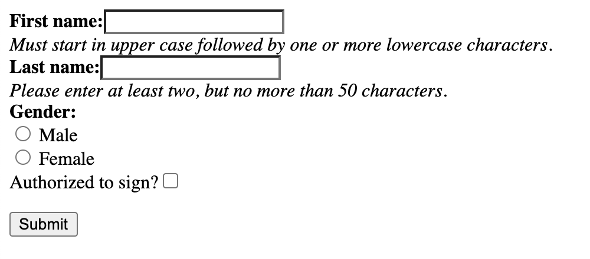
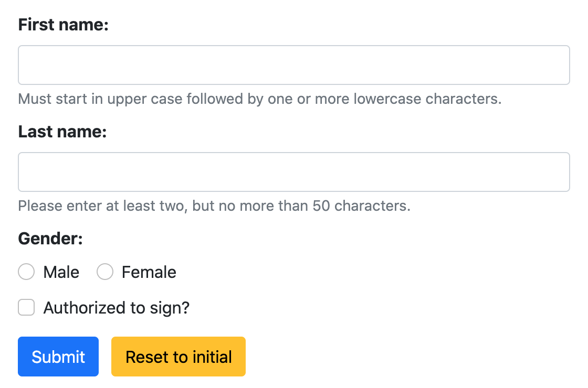
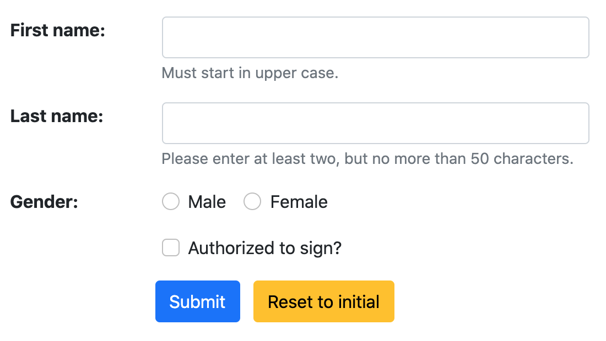
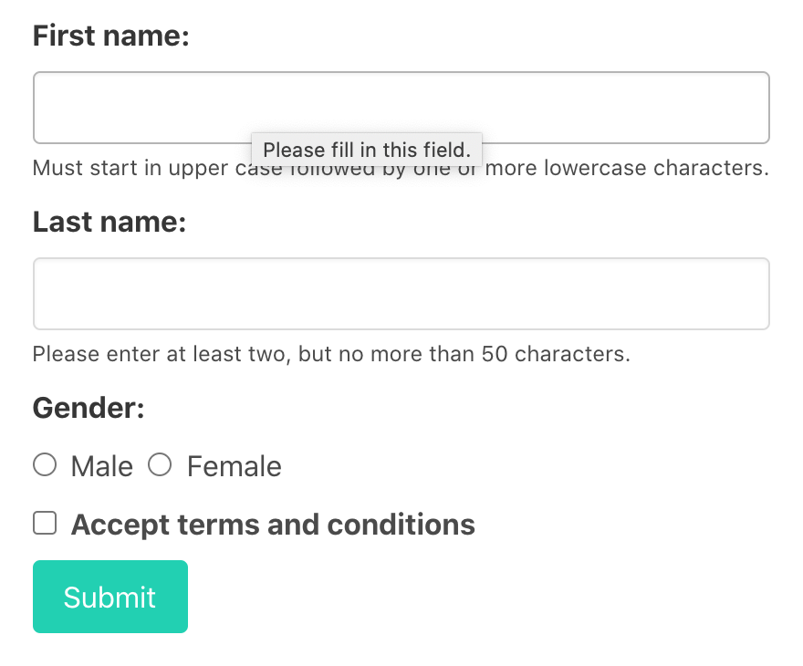
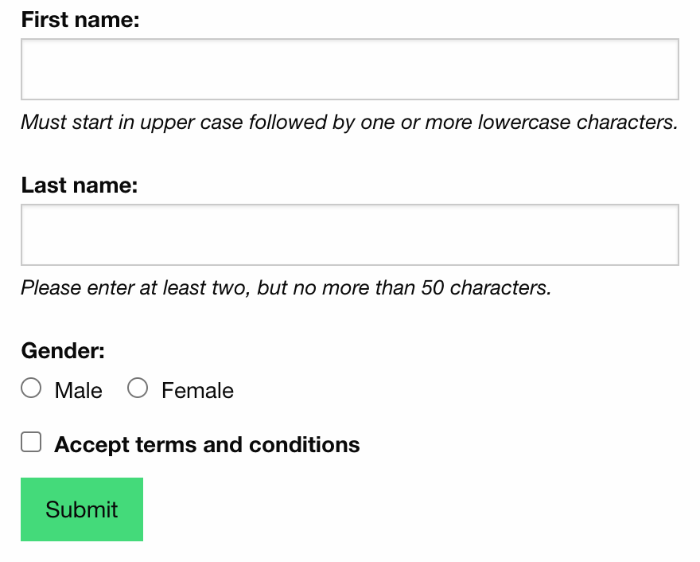
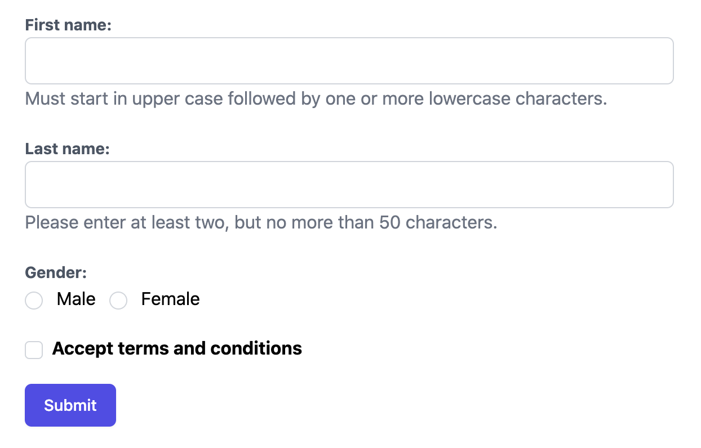

.. _styling:

=================================
Styling Forms with django-formset
=================================

**django-formset** ships with renderers, each one specialized to render all possible Django form
widgets, for five different CSS frameworks.

* Input fields of type text, with validation for minimum and maximum input length.
* Input fields of type text with pattern matching.
* Input fields of type number, with validation on their input range.
* Input fields of type date. This currently uses the default date widget from the browser, but
  future versions will offer their own native date widget.
* Checkboxes for a single input. They can be styled by reversing the label with its input field.
* Radio buttons with support for option groups. They can be arranged to align either horizontally
  or vertically.
* Multiple checkboxes with support for option groups. They can be arranged to align either
  horizontally or vertically.
* Select widgets with predefined options.
* Select widgets with autocomplete behavior.
* Select widgets allowing a limited number of multiple selections.
* Select widgets with a source and target field, allowing a large number of multiple selections.
  This widget usually is used for fields mapping a many-to-many relation.
* Textarea fields.
* Rich textarea fields.
* Slug input fields.
* File upload fields with asynchronous upload and drag & drop support.

Currently not supported widgets:

* `Geospatial fields`_

.. _Geospatial fields: https://docs.djangoproject.com/en/stable/ref/contrib/gis/forms-api/

Default Styling
===============

The default **django-formset** styling intentionally renders all the fields as the browser would by
default. This admittedly looks very rough and we only use it, if we want to style every aspect of
our website. This requires us to write the CSS ourselves. If we use one of the known CSS frameworks,
then instead we will proceed with one of the specialized renderers. The concept for rendering a form
remains the same, independently of the CSS framework.

Say we have a typical Django form

.. code-block:: python

	from django.forms import forms, fields
	
	class RegisterPersonForm(forms.Form):
	    first_name = fields.RegexField(
	        r'^[A-Z][a-z -]+$',
	        label="First name",
	        error_messages={'invalid': "A first name must start in upper case."},
	        help_text="Must start in upper case followed by one or more lowercase characters.",
	    )

	    last_name = fields.CharField(
	        label="Last name",
	        min_length=2,
	        max_length=50,
	        help_text="Please enter at least two, but no more than 50 characters.",
	    )

	    gender = fields.ChoiceField(
	        label="Gender",
	        choices=[('m', "Male"), ('f', "Female")],
	        widget=widgets.RadioSelect,
	        error_messages={'invalid_choice': "Please select your gender."},
	    )

	    authorized = fields.BooleanField(
	        label="Authorized to sign?",
	    )

When rendered using the view class :class:`formset.views.FormView` together with this template 

.. code-block:: django

	

	<django-formset endpoint="{{ request.path }}" csrf-token="{{ csrf_token }}">
	  
	  <button type="button" click="submit -> proceed">Submit</button>
	</django-formset>

That form displays two text input fields, one for the person's first- and its last name. Here we
declared two constraints on the first two fields: The first name must start in upper case and
contain at least one additional character in lower case, while the last name must consist of at
least two, but no more than 50 characters. Additionally the user has to choose his gender using
two radio input fields and a mandatory checkbox input to accept the terms and conditions.

Styling this form now is up to you. Use this as a starting point, if you edit the CSS of your
project anyway. There are a few HTML tags and CSS classes, which might help styling:

* ``django-fieldgroup > label``: The label right above the input element. 
* ``django-fieldgroup input[type="..."]``: The input element. Use the correct ``type`` here.
* ``django-fieldgroup > .dj-help-text``: Some optional help text below the input field(s).
* ``django-fieldgroup > ul.dj-errorlist li.dj-placeholder``: This list-element usually is empty.
  If filled, it contains the validation error message. 

Always remember to add

.. code-block:: django

	

anywhere inside the ``<head>``-element of the page.

Bootstrap
=========

Bootstrap is probably the most popular CSS framework nowadays, and **django-formset** offers a
renderer, which renders all its input fields as proposed by the `Bootstrap's form usage guide`_.

.. _Bootstrap's form usage guide: https://getbootstrap.com/docs/5.2/forms/overview/

In the template from above, we simply replace the templatetag against

.. code-block:: django

	

and get the same form instance rendered in a much nicer looking way:

Compared to the unstyled form shown in the previous section, we notice that the radio fields
are inlined and that the checkbox is positioned before its label. This is intended behavior.

According to the Bootstrap's usage guide, checkboxes shall be placed on the left side of their
label. Django can't handle this by itself, because it does not distinguish between checkbox input
fields and other types of fields.

Inlining Form Fields
--------------------

By using slightly different parameters, a form can be rendered with labels and input fields side
by side, rather than beneath each other. This can be achieved by applying these CSS classes
to the templatetag

.. code-block:: django

	<django-formset endpoint="{{ request.path }}" csrf-token="{{ csrf_token }}">
	  
	  

	    <button type="button" click="submit -> proceed">Submit</button>
	  

	</django-formset>

and we get a form rendered as

Inlining Radio Buttons and Multiple Checkboxes
----------------------------------------------

In **django-formset**, radio buttons and/or multiple checkboxes can be inlined, if there are only a
few of them. The default threshold is 4 and can be modified with the parameter
``max_options_per_line``. It can be passed in through the templatetag

.. code-block:: django

	  

If the number of radio buttons and/or multiple checkboxes exceeds this threshold, those fields are
rendered below each other.

Bulma
=====

Bulma is another popular CSS framework nowadays, and **django-formset** offers a renderer, which
renders all its input fields as proposed by `Bulma's form control usage guide`_.

.. _Bulma's form control usage guide: https://bulma.io/documentation/form/general/

In the template from above, we simply replace the templatetag against

.. code-block:: django

	

and get the form instance rendered as:

Foundation
==========

Foundation claims to be the most advanced responsive front-end framework in the world.
**django-formset** offers a renderer, which renders all its input fields as proposed by
`Foundation's form control usage guide`_.

.. _Foundation's form control usage guide: https://get.foundation/sites/docs/forms.html

In the template from above, we simply replace the templatetag against

.. code-block:: django

	

and get the form instance rendered as:

.. note:: Foundation currently does not get full support.

Tailwind
========

`Tailwind CSS`_ has attracted a lot of attention in the near past. It probably is the second most
popular CSS framework after Bootstrap these days. The way Tailwind handles primitive elements such
as input fields, requires an opinionated set of CSS classes as provided with a sample file for this
project. Since Tailwind does not provide a form control usage guide, it's up to the developers to
define those classes for their project.

.. _Tailwind CSS: https://tailwindcss.com/

In the template from above, we must include the opinionated style definitions for our form elements
or replace them against our individually styled ones. The form then is rendered with

.. code-block:: django

	...
	<link href="/static/testapp/css/tailwind.css" rel="stylesheet" type="text/css">
	...
	

and looks as expected 

To adopt the form element styles, **django-formset** provides these CSS classes:

* ``formset-label``: Styling for the input label.
* ``formset-text-input``, ``formset-email-input``, ``formset-date-input``, ``formset-select``,
  ``formset-select-multiple``, ``formset-number-input``, ``formset-textarea``,
  ``formset-password-input``: Styling the input field of the corresponding type.
* ``formset-dual-selector-select``: Styling of the two ``<select multiple>`` fields.
* ``formset-dual-selector-lookup``: Styling of the two ``<input>`` fields used for option lookup.
* ``formset-checkbox``, ``formset-checkbox-multiple``: Styling of the checkbox input fields.
* ``formset-radio-select``: Styling of the radio input fields.
* ``formset-inlined``: Styling for the wrapper of inlined checkbox and/or radio input fields.
* ``formset-help-text``: Styling of the ```` element with a help text below input fields.
* ``dj-choose-file``: Styling of the button to open the file browser.
* ``dj-delete-file``: Styling of the button to delete a selected file.
* ``dj-download-file``: Styling of the button to download a selected file.

UIKit
=====

UIKit claims to be a lightweight and modular front-end framework for developing fast and powerful
web interfaces. It has been added for completeness to test the form rendering capabilities of
**django-formset** when working with exotic CSS frameworks. It offers a renderer, which renders all
input fields as proposed by `UIKit's form rendering guide`_.

.. _UIKit's form rendering guide: https://getuikit.com/docs/form

Unless there is a strong community interest, support for this framework might be removed in the
future, since I do not see any benefit using UIKit compared to any of the much more popular and
advanced CSS frameworks listed here.
