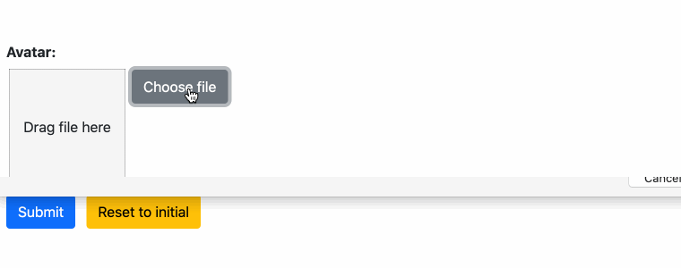

.. _uploading:

==========================
Uploading Files and Images
==========================

In traditionally rendered forms, the payload of files to be uploaded is submitted together with the
form data. This approach is not very user friendly, because submitting such a form can take a
considerable amount of time and if the form does not validate on the server, that upload must be
repeated again. Moreover, if a form contains more than one file to be uploaded, the maximum size a
client can upload to the server must be shared for all of them [1]_, [2]_.

.. [1] On Apache this parameter is configured through the LimitRequestBody_ directive.
.. [2] On NGiNX this parameter is configured through the client_max_body_size_ directive.
.. _LimitRequestBody: https://httpd.apache.org/docs/2.4/mod/core.html#limitrequestbody
.. _client_max_body_size: http://nginx.org/en/docs/http/ngx_http_core_module.html#client_max_body_size

Therefore **django-formset** handles file uploads asynchronously. This means that the payload of a
file is uploaded to the server as soon as the user opens the file dialog or drags a file into the
form. While that file is uploading, the user can fill out other fields. The uploaded file is
stored in a temporary folder on the server. After successful file upload, a unique and signed handle
is returned to the client. On form submission, this handle then is used to refer to the previously
uploaded file inside the temporary folder. If the form validated properly, that file then is moved
to its final destination.

Example
-------

A Django Form accepting files for upload can be converted easily to **django-formset**'s
asynchronous file uploads, simply by replacing the widget.

.. code-block:: python

	from django.forms import forms, fields
	
	from formset.widgets import UploadedFileInput
	
	class UploadForm(forms.Form):
	    avatar = fields.FileField(
	        label="Avatar",
	        widget=UploadedFileInput,
	        required=True,
	    )

Remember, the Django View accepting the form data, must inherit from
:class:`formset.views.FileUploadMixin`. No extra endpoint is required to activate this feature.

If an uploaded file contains an image renderable by the browser, that image is resized on the server
and a thumbnail version is returned to the client. For other file types, a symbolic icon is
returned.
