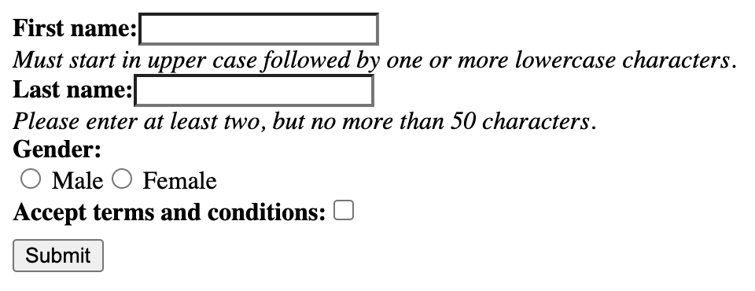
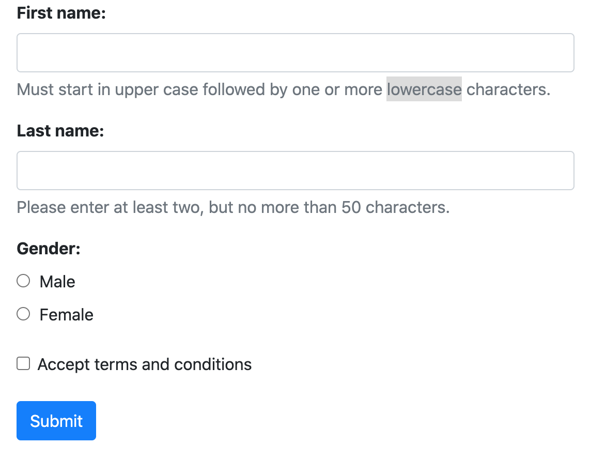

.. _usage:

====================
Using django-formset
====================

**django-formset** ships with three types of renderers, suitable for most uses. Say, we have defined
a Django form, then we would have these options on how to render it:

* Rendering the form using the special template tag ``render_groups``.
* Using the special mixin class ``FormMixin`` from which the form declaration inherits. 
* Using the template filter ``formsetify`` when iterating over the form fields. 

We choose one of these, depending on wheather we want to adopt the template used to render the form,
or otherwise prefer to change the form definition class. Either way the outcoming result is the
same. These three alternatives exists for all supported formset styles: Default, Bootstrap, Bulma,
Foundation and Tailwind.

Default Styling
===============

The default **django-formset** styling intentionally renders all the fields as the browser would by
default. This admiditly looks very rough and we only use it, if we want to style every aspect of our
web site. This requires to write the CSS ourselfs. If we use one of the known CSS frameworks, then
instead we will proceed with one of the specialized renderes. The concept for these three rendering
functions remains to same, independently of the CSS framework.

Consider having a standard Django Form instance, say 

.. code-block:: python

	from django.forms import forms, fields
	
	class PersonForm(forms.Form):
	    name = 'person'
	
	    first_name = fields.RegexField(
	        r'^[A-Z][a-z -]+$',
	        label="First name",
	        error_messages={'invalid': "A first name must start in upper case."},
	        help_text="Must start in upper case followed by one or more lowercase characters.",
	    )
	
	    last_name = fields.CharField(
	        label="Last name",
	        min_length=2,
	        max_length=50,
	        help_text="Please enter at least two, but no more than 50 characters.",
	    )

	    gender = fields.ChoiceField(
	        label="Gender",
	        choices=[('m', "Male"), ('f', "Female")],
	        widget=widgets.RadioSelect,
	        error_messages={'invalid_choice': "Please select your gender."},
	    )

	    accept = fields.BooleanField(
	        label="Accept terms and conditions",
	        initial=False,
	    )

When rendered by Django, that form displays two text input fields, one for the person's first- and
its last name. Here we declared two constraints on the first two fields: The first name must start
in upper case and contain at least one additional character in lower case, while the last name must
consist from at least two, but no more than 50 characters. Additionally the user has to choose his
gender using two radio input fields and a mandatory checkbox input to accept the terms and
conditions.

Using templatetag ``render_groups``
-----------------------------------

This probably is the simplest recipe to render to above form. Here we use the templatetag
```` to render all fields wrapped inside their field-groups.

.. code-block:: django

	

	<django-formset endpoint="/path/to/endpoint">
	    <form name="{{ form.name }}">
	        
	        
	    </form>
	    <button type="button" click="submit">Submit</button>
	</django-formset>

We use this method, if we want to keep the form declaration separate from the rendering logic.

Always remember to add

.. code-block:: django

	

anywhere inside the ``<head>``-element of the page.

Using filter ``formsetify`` with templatetag ``render_group``
-------------------------------------------------------------

If we need more fine grained control over how individual fields are rendered, then this recipe
suits best:

.. code-block:: django

	
	
	
	<django-formset endpoint="/path/to/endpoint">
	    <form name="{{ form.name }}">
	        
	        
	        
	        
	        
	    </form>
	    <button type="button" click="submit">Submit</button>
	</django-formset>
	

Here we could for instance wrap some fields into different HTML elements, depending on their field
names. This can be used to group fields in a certain manner.

.. note:: Remember to add the JavaScript module ``formset/js/django-formset.js`` to the HTML page.

Using mixin class :class:`formset.mixins.default.FormMixin`
-----------------------------------------------------------

If we do not want to interfer with existing templates, we can add the **django-formset**
functionality via mixin to the form declaration. We then would rewrite the above form
as

.. code-block:: python

	from django.forms import forms, fields
	from formset.mixins.default import FormMixin
	
	class PersonForm(FormMixin, forms.Form):
	    # fields as in the above example
	    ...

The template to render this view then looks like as we use it in classic templates:

.. code-block:: django

	<django-formset endpoint="{{ request.path }}">
	    <form name="{{ form.name }}">
	        
	        {{ form }}
	    </form>
	    <button type="button" click="submit">Submit</button>
	</django-formset>

The difference is that this mixin overrides the ``__str__()``-method and renders the form using
its own method, namely ``as_field_groups()`` instead of ``as_table()``.

When rendered, this form will look like:

Use this as a starting point, if you edit the CSS of your project anyway. There are a few HTML tags
and CSS classes, which might help styling:

* ``django-fieldgroup > label``: The label right above the input element. 
* ``django-fieldgroup input[type="..."]``: The input element. Use the correct ``type`` here.
* ``django-fieldgroup > .dj-help-text``: Some optional helptext below the input field(s).
* ``django-fieldgroup > ul.dj-errorlist li.dj-placeholder``: This list-element usually is empty.
  If filled, it contains the validation error message. 

Styling with Bootstrap
======================

This renderer is optimized to render all input fields as proposed by the `Boostrap's form usage
guide <https://getbootstrap.com/docs/4.6/components/forms/>`_.

Using templatetag ``render_groups`` or ``formsetify`` with templatetag ``render_group``
---------------------------------------------------------------------------------------

The Django form can be rendered using the usual three recipes. Here, instead of loading the
templatetag-library ``django_formset``, use ``bootstrap_formset``. The internal rendering functions 
then will take care of rendering all their form fields using the style as proposed by the
Bootstrap's user guide.

Using mixin class :class:`formset.mixins.bootstrap.FormMixin`
-------------------------------------------------------------

Here we let our form declaration inherit from the mixin class . 

.. code-block:: python

	from django.forms import forms, fields
	from formset.mixins.bootstrap import FormMixin
	
	class PersonForm(FormMixin, forms.Form):
	    # fields as in the above example
	    ...

Either way, the form will be renderd as:

